# Praxis® Core Academic Skills for Educators: Reading Practice Test 1

# Time: 85 Minutes

Directions: Read the following passages and answer the questions that follow.

Use the following passage to answer questions 1 and 2.

Of the numerous American automotive pioneers, perhaps among the best known are Charles and Frank Duryea. Beginning their work of automobile building in Springfield,   
5 Massachusetts, and, after much rebuilding, they constructed their first successful vehicle in 1892 and 1893. No sooner was this finished than Frank, working alone, began work on a second vehicle having a two-cylinder engine. With this   
10 automobile, sufficient capital was attracted in 1895 to form the Duryea Motor Wagon Company in which both brothers were among the stockholders and directors. A short time after the formation of the company, this second   
15 automobile was entered by the company in the Chicago Times-Herald automobile race on Thanksgiving Day, November 28, 1895, where Frank Duryea won a victory over the other five contestants—two electric automobiles and   
20 three Benz machines imported from Germany.

Source: Excerpt from The 1893 Duryea Automobile by Don H. Berkebile.

1. Which of the following is the best summary of the passage?

a. There were many automotive pioneers in America, but the best known were the brothers Charles and Frank Duryea, who began building automobiles in Springfield, Massachusetts.
b. Charles and Frank Duryea were among the best-known American automotive pioneers, but Frank was more famous than his brother Charles because Frank won the Chicago Times-Herald automobile race.   
c. On Thanksgiving Day, November 28, 1895, Frank Duryea won the Chicago Times-Herald automobile race over five other contestants: two electric automobiles and three Benz machines from Germany.   
d. Charles and Frank Duryea were pioneering automobile builders, and Frank developed a profitable two-cylinder engine vehicle with which he won the Chicago Times-Herald automobile race.   
e. Although Frank Duryea developed a two-cylinder engine vehicle, both he and his brother Charles profited from it because it earned them the capital to start the Duryea Motor Wagon Company.

2. In the passage, the author describes the kinds of cars Frank Duryea defeated in the Chicago Times-Herald automobile race in order to

a. show that the best automobiles in the world are built in Springfield, Massachusetts.   
b. imply that he would later develop an electric car for the Duryea Motor Wagon Company.   
c. indicate that the quality of automobiles being developed in Europe was very poor at the time.   
d. suggest that the kind of car he drove is what helped him win the race.   
e. help the reader understand the differences between two-cylinder vehicles and electric automobiles.

Use the following passage to answer questions 3 through 5.

It is not always easy to identify a stone, even with a fresh surface; in a weathered specimen it is often impossible. For this reason the material of which a specimen is made may not be correctly named; frequently the alteration due to exposure will change the appearance of a rock very much, and in such a case the best that can be done is to tell what it looks most like. The material of a majority of specimens, however, or at least the classes of rock to which they belong, as granite, porphyry, etc., are correctly named; to give a more exact name would be possible only by the destruction or injury of the specimen.

Source: Excerpt from Stone Art by Gerard Fowke

3. The author's ideas could best be reinforced with illustrations of rocks

a. in different stages of weathering.   
b. in the granite and porphyry classes.   
c. procured from the bottom of the ocean.   
d. that have been completely destroyed.   
e. commonly found in most areas of the United States.

4. Which of the following would be the best title for this passage?

a. "The Names of Various Rocks"   
b. "Why Granite Is Called Granite"   
c. "The Classes of Rocks"   
d. "Why Rocks Must Be Destroyed"   
e. "The Difficulties of Identifying Rocks"

5. What is the best definition for the word fresh as it is used in line 2 of the passage?

a. novel   
b. unmarked   
c. bright   
d. clean   
e. airy

Use the following passage to answer question 6.

The Pennsylvania Dutch are a hard working people and as they say, "Them that works hard, eats hearty." The blending of recipes from their many home lands and the ingredients available

5 in their new land produced tasty dishes that have been handed down from mother to daughter for generations.

Source: Excerpt from Pennsylvania Dutch Cooking

6. The author of this passage would most likely agree with which of the following statements?

a. The Pennsylvania Dutch people work harder than any other group of people in America.   
b. One of the distinguishing characteristics of the Pennsylvania Dutch people is their excellent cuisine.   
c. The Pennsylvania Dutch people are known throughout the world for their colorful and amusing sayings.   
d. No group of people blends recipes as well as the Pennsylvania Dutch people do.   
e. If fathers and sons in Pennsylvania Dutch families made food, it would not be as good as the food mothers and daughters make.

Use the following passage pair to answer questions 7 through 10.

# Passage 1

The variety of species among the jumping spiders appears almost infinite. The genus, or rather family of Epeira, is here characterized by many singular forms; some species have

5 pointed coriaceous shells, others enlarged and spiny tibiae. Every path in the forest is barricaded with the strong yellow web of a species belonging to the same division with the Epeira clavipes of Fabricius, which was formerly said   
10 by Sloane to make, in the West Indies, webs so strong as to catch birds. A small and pretty kind of spider, with very long forelegs, and which appears to belong to an undescribed genus, lives as a parasite on almost every one of these   
15 webs. I suppose it is too insignificant to be noticed by the great Epeira, and is therefore allowed to prey on the minute insects, which, adhering to the lines, would otherwise be wasted. When frightened, this little spider   
20 either feigns death by extending its front legs, or suddenly drops from the web.

Source: Excerpt from Some Wonderful Spiders by Charles Darwin

# Passage 2

There are, among spiders, two forms of protective modification: the first, including all cases of protective resemblance to vegetable and inorganic things—that is, all modifications of color

5 or of color and form that tend to make them inconspicuous in their natural relations—I shall call direct protection. The second form, which I shall call indirect protection, includes two classes, the spiders which are specially pro-  
10 tected themselves and those which mimic other creatures which are specially protected.

Spiders are specially protected when they become inedible through the acquisition of hard plates and sharp spines. The modification of form is frequently accompanied by conspicuous colors, which warn their enemies that they belong to an unpalatable class.

Source: Excerpt from Protective Resemblances in Spiders by Elizabeth G. Pechham

7. Which of the following best describes the relationship between Passage 1 and Passage 2?

a. Passage 1 makes an argument and Passage 2 contradicts it.   
b. Passage 1 introduces an idea and Passage 2 expands on it.   
c. Passage 1 introduces a difficult concept and Passage 2 explains it.   
d. Passage 1 states facts and Passage 2 states opinions.   
e. Passage 1 makes a claim and Passage 2 supports that claim.

8. With which of the following statements about the undescribed genus of spider that lives in the West Indies would the author of Passage 1 most likely agree?

a. It deserves to be named.   
b. It is unimportant.   
c. It is uniquely attractive.   
d. It is an enemy of many animals.   
e. It is cowardly.

9. In what way is Passage 1 different from Passage 2?

a. Passage 1 describes the behaviors of several animals.   
b. Passage 1 uses scientific research to support its conclusions.   
c. Passage 1 is written from a first-person perspective.   
d. Passage 1 includes personal opinions.   
e. Passage 1 describes how spiders use their bodies to protect themselves.

10. The primary concern of Passage 2 is

a. establishing a definition of the term protective modification.   
b. describing how the colors of their bodies help to protect spiders.   
c. identifying why certain spiders have sharp spines on their bodies.   
d. providing details about the Epeira clavipes of Fabricius.   
e. explaining the two main ways spiders use their bodies to protect themselves.

Use the following passage to answer questions 11 and 12.

Frederick Douglass lived so long, and played so conspicuous a part on the world's stage, that it would be impossible, in a work of the size of this, to do more than touch upon the salient

5 features of his career, to suggest the respects in which he influenced the course of events in his lifetime, and to epitomize for the readers of another generation the judgment of his contemporaries as to his genius and his character.

10 Douglass's fame as an orator has long been secure. His position as the champion of an oppressed race, and at the same time an example of its possibilities, was, in his own generation, as picturesque as it was unique; and his

15 life may serve for all time as an incentive to aspiring souls who would fight the battles and win the love of mankind.

Source: Frederick Douglass by Charles Chestnutt

11. The passage suggests that Frederick Douglass

a. was most concerned with being loved by other people.   
b. mostly influenced matters in his hometown.   
c. had a uniquely engaging personality.   
d. has been the topic of many long history books.   
e. was mostly famous for being a great speaker.

12. In the passage, the word salient most nearly means

a. outstanding.   
b. factual.   
c. silent.   
d. minor.   
e. proven.

Use the following passage to answer questions 13 through 15.

The account of this second journey of the Polos may be read in the wonderful book which Marco afterwards wrote to describe the won-ders of the world. They went from Lajazzo   
5 through Turcomania, past Mount Ararat, where Marco heard tell that Noah's ark rested, and where he first heard also of the oil wells of Baku and the great inland sea of Caspian. Past Mosul and Bagdad they went, through Persia, where   
10 brocades are woven and merchants bring caravan after caravan of treasures, to Hormuz, on the Persian Gulf, into which port put the ships from India, laden with spices, drugs, scented woods, and jewels, gold tissues and elephants'   
15 teeth. Here they meant to take ship, but they desisted, perhaps because they feared to trust

themselves to the flimsy nailless vessels in which the Arabs braved the dangers of the Indian Ocean. So they turned north again and

20 prepared to make the journey by land. They traversed the salt desert of Kerman, through Balk and Khorassan to Badakhshan, where there are horses bred from Alexander the Great's steed Bucephalus, and ruby mines and

25 lapis lazuli. It is a land of beautiful mountains and wide plains, of trout streams and good hunting, and here the brothers sojourned for nearly a year, for young Marco had fallen ill in the hot plains: a breath of mountain air blows

30 through the page in which he describes how amid the clean winds his health came back to him.

Source: Excerpt from A Short History of the World by H.G. Wells

13. The passage suggests that Marco Polo was

a. generally easy to convince of fantastical things.   
b. a man who possessed multiple extraordinary skills.   
c. a coward compared to Arabian sailors.   
d. homesick much of his life.   
e. often in poor health because of his exhausting lifestyle.

14. The passage is primarily concerned with

a. the written work of Marco Polo.   
b. Marco Polo's experiences in Turcomania.   
c. the landscape of Badakhshan.   
d. the travels of Marco Polo.   
e. the people with whom Marco Polo traveled.

15. In line 1, the word account most nearly means

a. report.   
b. balance.   
c. judgment.   
d. credit.   
e. reason.

Use the following passage pair to answer questions 16 through 18.

# Passage 1

American independence, the beginnings of which we have just been considering, was accomplished after a long struggle. Many brave men fought on the battle-field, and many who never shouldered a musket or drew a sword exerted a powerful influence for the good of the patriot cause. One of these men was Benjamin Franklin.

He was born in Boston in 1706, the fifteenth child in a family of seventeen children. His father was a candle-maker and soap-boiler. Intending to make a clergyman of Benjamin, he sent him, at eight years of age, to a grammar-school, with the purpose of fitting him for college. The boy made rapid progress, but before the end of his first school-year his father took him out on account of the expense, and put him into a school where he would learn more practical subjects, such as writing and arithmetic. The last study proved very difficult for him.

Source: Excerpt from American Leaders and Heroes: A Preliminary Text-Book in United States History by Wilbur F. Gordy

# Passage 2

At ten years old I was taken home to assist my father in his business, which was that of a tallow-chandler and sope-boiler; a business he was not bred to, but had assumed on his arrival in New England, and on finding his dying trade would not maintain his family, being in little request. Accordingly, I was employed in cutting wick for the candles, filling the dipping mold and the molds for cast candles, attending the shop, going of errands, etc.

I disliked the trade, and had a strong inclination for the sea, but my father declared

against it; however, living near the water, I was much in and about it, learnt early to swim well,   
15 and to manage boats; and when in a boat or canoe with other boys, I was commonly allowed to govern, especially in any case of difficulty; and upon other occasions I was generally a leader among the boys, and sometimes led   
20 them into scrapes, of which I will mention one instance, as it shows an early projecting public spirit, tho' not then justly conducted.

Source: Excerpt from Benjamin Franklin: His Autobiography by Benjamin Franklin

16. Based on the information in Passage 2, one can conclude that Benjamin Franklin

a. wished he could follow in his father's footsteps.   
b. never learned how to make candles.   
c. tended to communicate informally.   
d. preferred making candles to boiling soap.   
e. was not well liked by the other boys.

17. Which of the following is a difference between Passage 1 and Passage 2?

a. Passage 1 is more humorous than Passage 2.   
b. Passage 1 tells the story of one person's life.   
c. Passage 1 is about the life of an important American.   
d. Passage 1 is more specific than Passage 2.   
e. Passage 1 focuses more on a particular period of time.

18. Which of the following best describes the relationship between Passage 1 and Passage 2?

a. Passage 1 discusses a topic objectively and Passage 2 discusses it personally.   
b. Passage 1 presents a question and Passage 2 answers it.   
c. Passage 1 describes a method and Passage 2 shows how it is put to use.   
d. Passage 1 presents information that contradicts Passage 2.   
e. Passage 1 describes a specific aspect of Passage 2.

Use the following passage to answer questions 19 through 21.

The steamboat was, if anything, a little ahead of the steam engine in its earlier phases. There was a steamboat, the Charlotte Dundas, on the Firth of Clyde Canal in 1802, and in 1807 an Ameri-  
5 can named Fulton had a steamer, the Clermont, with British-built engines, upon the Hudson River above New York. The first steamship to put to sea was also an American, the Phænix, which went from New York (Hoboken) to Phil-  
10 adelphia. So, too, was the first ship using steam (she also had sails) to cross the Atlantic, the Savannah (1819). All these were paddle-wheel boats and paddle-wheel boats are not adapted to work in heavy seas. The paddles smash too   
15 easily, and the boat is then disabled. The screw steamship followed rather slowly. Many difficulties had to be surmounted before the screw was a practicable thing.

Source: Excerpt from The Frontier in American History by Frederick Jackson Turner

A TIMELINE OF EARLY STEAMSHIP HISTORY 

<table><tr><td>1807</td><td>The steamboat emerges as a practical form of travel.</td></tr><tr><td>1811</td><td>The first steamboat travels the Mississippi River.</td></tr><tr><td>1818</td><td>First steamboat service on the Mediterranean Sea</td></tr><tr><td>1819</td><td>The first steamboat crosses the Atlantic Ocean.</td></tr><tr><td>1838</td><td>First transatlantic steamboat service</td></tr><tr><td>1851</td><td>John Elder patents compound steam engine.</td></tr></table>

19. The main purpose of this passage is to

a. compare the steamboat to the steam engine.   
b. provide information about the early history of the steamboat.   
c. explain why Fulton was an important American.   
d. provide a list of important dates in steamboat history.   
e. describe the flaws in the paddle-wheel boats.

20. Based on information in the passage and the timeline, which of the following is most likely true?

a. The Charlotte Dundas was the first steamboat to travel on the Mississippi River.   
b. The Phoenix was the first steamboat to cross the Atlantic Ocean in 1819.   
c. The Savannah was the first steamboat service on the Mediterranean Sea.   
d. The screw steamship was identical to the compound steam engine.   
e. The Clermont helped demonstrate that the steamboat was a practical form of travel.

21. Which of the following could be a factor in the difference between the steamships described in this passage and the steamships developed after them?

a. The steamships developed after them could not cross oceans.   
b. The steamships developed after them were the first to use British-built engines.   
c. The steamships developed after them were made in America.   
d. The steamships developed after them probably did not have paddles.   
e. The steamships developed after them were paddle-wheel boats.

Use the following passage to answer questions 22 and 23.

The most ancient materials used for recording events were bricks, tiles, shells, and tables of stone. The modes of writing on these different substances were various. The tiles and brick were impressed with a stamp when in a soft state; the shells and tablets of stone were etched or graven, the figures or characters being cut in their surface, and in some cases also stained with various colors. It was by the ancient art of stamping that the walls, palaces, and towers of Babylon were covered with hieroglyphics, which have but recently been brought to light from under the immense mounds of Mesopotamia by Layard and other explorers.

Source: Excerpt from Gutenberg, and the Art of Printing by Emily Clemens Pearson

22. The last sentence in the passage provides

a. an interesting yet incidental detail not directly related to the rest of the passage.

b. details that contrast information already provided in the passage.

c. a description of how a process briefly introduced earlier in the passage was performed.

d. a personal account of information described objectively earlier in the passage.

e. an example of how techniques described in the passage were used.

23. The passage suggests that after impressing a stamp on a brick, the brick

a. was dyed red.

b. lost its original shape.

c. was covered in hieroglyphics.

d. would harden.

e. was graven.

Use the following passage to answer questions 24 and 25.

A history of architecture is a record of man's efforts to build beautifully. The erection of structures devoid of beauty is mere building, a trade and not an art. Edifices in which

5 strength and stability alone are sought, and in designing which only utilitarian considerations have been followed, are properly works of engineering. Only when the idea of beauty is added to that of use does a structure take its place

10 among works of architecture. We may, then, define architecture as the art which seeks to harmonize in a building the requirements of utility and of beauty. It is the most useful of the fine arts and the noblest of the useful arts.

Source: Excerpt from A Text-Book of the History of Architecture by A.D.F. Hamlin

24. The final sentence of the passage makes which of the following errors in logic?

a. incomplete comparison

b. faulty generalization

c. circular reasoning

d. fallacy of composition

e. moral equivalence

25. In the passage, the author refers to works of engineering in order to

a. use them as examples of architecture.

b. describe the designs common in architecture.

c. illustrate the different uses of architecture.

d. contrast them with architecture.

e. provide a definition of the term architecture.

Use the following passage to answer question 26.

A man can live for three days without bread, but no man can live for one day without poetry, was an aphorism of Baudelaire. You can live without pictures and music but you cannot live

5 without eating, says the author of Dinners and Dishes; and this latter view is, no doubt, the more popular.

Source: Excerpt from "Review of Dinners and Dishes" by Oscar Wilde

26. Based only on the information in the passage, which of the following is a valid conclusion?

a. Most people would not agree with Baudelaire's aphorism quoted in the passage.

b. Dinners and Dishes is a more poetic piece of writing than Baudelaire ever created.

c. The author of the passage thinks that poetry is more important than pictures and music.

d. Dinners and Dishes is more concerned with pictures and music than eating.

e. The author of the passage believes that there is nothing poetic about pictures and music.

Use the following passage to answer questions 27 through 29.

Wood exhibits its greatest strength in tension parallel to the grain, and it is very uncommon in practice for a specimen to be pulled in two lengthwise. This is due to the difficulty of mak-

5 ing the end fastenings secure enough for the full tensile strength to be brought into play before the fastenings shear off longitudinally. This is not the case with metals, and as a result they are used in almost all places where tensile   
10 strength is particularly needed, even though the remainder of the structure, such as sills, beams, joists, posts, and flooring, may be of wood. Thus in a wooden truss bridge the tension members are steel rods.

15 The tensile strength of wood parallel to the grain depends upon the strength of the fibres and is affected not only by the nature and dimensions of the wood elements but also by their arrangement. It is greatest in straight-

20 grained specimens with thick-walled fibres. Cross grain of any kind materially reduces the tensile strength of wood, since the tensile strength at right angles to the grain is only a small fraction of that parallel to the grain.

Source: Excerpt from The Mechanical Properties of Wood by Samuel J. Record

RATIO OF STRENGTH OF WOOD IN TENSION AND IN COMPRESSION   
(BUL. 10, U.S. DIV. OF FORESTRY, p. 44) 

<table><tr><td rowspan="3">Kind of Wood</td><td rowspan="2">Ratio: R = Tensile strength</td><td colspan="2">A stick 1 square inch in cross section.</td></tr><tr><td colspan="2">Weight required to—</td></tr><tr><td>Compressive strength</td><td>Pull apart</td><td>Crush endwise</td></tr><tr><td>Hickory</td><td>3.7</td><td>32,000</td><td>8,500</td></tr><tr><td>Elm</td><td>3.8</td><td>29,000</td><td>7,500</td></tr><tr><td>Larch</td><td>2.3</td><td>19,400</td><td>8,600</td></tr><tr><td>Longleaf Pine</td><td>2.2</td><td>17,300</td><td>7,400</td></tr></table>

NOTE.—Moisture condition not given.

27. According to the passage, all of the following probably lacked considerable tensile strength EXCEPT

a. sills.   
b. beams.   
c. rods in a truss bridge.   
d. joists.   
e. flooring.

28. Based on information in the passage and the table, which of the following woods is most likely to have cross grain?

a. hickory   
b. elm   
c. larch   
d. balsa   
e. longleaf pine

29. Based on information in the passage and the table, which of the following is a factor that may affect the tensile strength of wood that is not indicated in the passage?

a. grain direction   
b. fiber strength   
c. nature of the wood elements   
d. moisture condition   
e. dimensions of the wood elements

Use the following passage to answer question 30.

The humorous story is strictly a work of art—high and delicate art—and only an artist can tell it; but no art is necessary in telling the comic and the witty story; anybody can do it.

5 The art of telling a humorous story—understand, I mean by word of mouth, not print—was created in America, and has remained at home.

Source: Excerpt from "How to Tell a Story" by Mark Twain

30. Which statement, if it were true, most significantly weakens the argument in the passage?

a. Native American storytellers had been telling humorous stories for hundreds of years.   
b. The plays of Aristophanes are among the earliest examples of humorous stories in writing.   
c. Mark Twain is widely regarded as one of the wittiest writers in American literature.   
d. The word art is most commonly applied to visual arts such as painting, sculpture, and drawing.   
e. It is important to understand certain rules before attempting to tell a comic story.

Use the following passage to answer questions 31 through 33.

Whenever we hear the name of Napoleon mentioned, or see it printed in a book, it is usually in connection with a hard-fought victory on the battlefield. He certainly spent most of his life in the camp, and enjoyed the society of soldiers more than that of courtiers. The thunder of guns, the charge of cavalry, and the flash of bayonets as they glittered in the sun, appealed to him with much the same force as music to more ordinary folk...

We are apt to forget that this mighty conqueror, whom Carlyle calls “our last great man,” had a childhood at all. He was born nearly a century and a half ago, on the 15th August 1769 to be exact, in the little town of Ajaccio, the capital of picturesque Corsica.

Source: Excerpt from The Story of Napoleon by Harold F.B. Wheeler

31. As it is used in the context of the sentence, which word best describes the meaning of force (line 9)?

a. compel   
b. intensity   
c. shove   
d. pry   
e. weight

32. Which conclusion can be reached from the passage?

a. The childhoods of people with intimidating reputations are often ignored.   
b. Nobody had ever considered Napoleon's childhood before this passage was written.   
c. Nothing is known about Napoleon's childhood at all.   
d. All details about Napoleon's childhood are based on speculation rather than concrete fact.   
e. Great conquerors never have noteworthy childhoods.

33. According to the passage, which of the following did Napoleon most likely prefer?

b. listening to music   
c. plotting a battle   
d. camping on a battlefield   
e. visiting Corsica

a. leading soldiers on the battlefield

Use the following passage to answer questions 34 through 38.

The color of animals is by no means a matter of chance; it depends on many considerations, but in the majority of cases tends to protect the animal from danger by rendering it less conspicu-  
5 ous. Perhaps it may be said that if coloring is mainly protective, there ought to be but few brightly colored animals. There are, however, not a few cases in which vivid colors are themselves protective. The kingfisher itself, though   
10 so brightly colored, is by no means easy to see. The blue harmonizes with the water, and the bird as it darts along the stream looks almost like a flash of sunlight; besides which, protection is not the only consideration. Let us now   
15 consider the prevalent colors of animals and see how far they support the rule.

Desert animals are generally the color of the desert. Thus, for instance, the lion, the antelope, and the wild ass are all sand-colored.

20 "Indeed," says Canon Tristram, "in the desert, where neither trees, brushwood, nor even undulation of the surface afford the slightest protection to its foes, a modification of color which shall be assimilated to that of the sur-  
25 rounding country is absolutely necessary. Hence, without exception, the upper plumage of every bird, whether lark, chat, sylvain, or sand grouse, and also the fur of all the smaller mammals and the skin of all the snakes and   
30 lizards, is of one uniform sand color."

Source: Excerpt from "The Colors of Animals" by Sir John Lubbock

34. The author's use of the word harmonizes in line 11 emphasizes

a. the sweet sound of the kingfisher's song.   
b. the musical sound of flowing water.   
c. the appealing glimmer of sunlight.   
d. how the kingfisher blends with its environment.   
e. how the sounds of a bird and water blend.

35. Which of the following alternate titles would be the most appropriate for this passage?

a. "Colors of the Desert"   
b. "Camouflage in the Wild"   
c. "The Plumage of Birds"   
d. "Why Kingfishers Are Blue"   
e. "The Vivid Colors of Animals"

36. In the first sentence, conspicuous most closely means

a. hidden.   
b. conspiratorial.   
c. obvious.   
d. conscious.   
e. attractive.

37. The author includes the quotation from Canon Tristram in order to

a. show that authorities agree with the author's opinions.   
b. illustrate an idea that the author could not have explained himself.   
c. support an argument that is not very popular.   
d. prove that birds are unique creatures.   
e. develop upon an idea the author had already introduced.

38. Based on the information in the passage, desert animals might not need to be the color of sand if the desert

a. did not have so many trees.   
b. had more colorful sand.   
c. was cooler.   
d. experienced more surface changes.   
e. had fewer animals.

Use the following passage to answer questions 39 and 40.

Although very much yet remains to be learned about this old earth, it is a remarkable fact that man, through the exercise of his highest faculty, has come to know so much concerning it.

5 The following words, by the late Professor Barrell, admirably summarize the significance of geological history. "The great lesson taught by the study of the outer crust is that the earth mother, like her children, has attained her

10 present form through ceaseless change, which marks the pulse of life and which shall cease only when her internal forces slumber and the cloudy air and surf-bound ocean no more are moving garments. The flowing landscapes of

15 geologic time may be likened to a kinetoscopic panorama. The scenes transform from age to

age, as from act to act; seas and plains and mountains of different types follow and replace each other through time, as the traveler sees them succeed each other in space."

Source: Excerpt from Geology: The Science of the Earth's Crust by William J. Miller

39. As used in the passage, the word space most nearly means

a. portion of area.   
b. atmosphere beyond Earth.   
c. room.   
d. surface.   
e. depth.

40. Which of the following best describes the point of view of the passage?

a. first person   
b. second person   
c. third person   
d. fourth person   
e. fifth person

Use the following passage to answer questions 41 and 42.

Science is knowledge; it is what we know. But mere knowledge is not science. For a bit of knowledge to become a part of science, its relation to other bits of knowledge must be found.
5 In botany, for example, bits of knowledge about plants do not make a science of botany. To have a science of botany, we must not only know about leaves, roots, flowers, seeds, etc., but we must know the relations of these parts and of all the parts of a plant to one another. In other words, in science, we must not only know, we must not only have knowledge, but we must

know the significance of the knowledge, must know its meaning. This is only another way of saying that we must have knowledge and know its relation to other knowledge.

Source: Excerpt from The Science of Human Nature by William Henry Pyle

41. The author of this passage would most likely agree with which of the following statements?

a. A real botanist focuses more attention on leaves than roots.   
b. A biologist cannot understand how the heart works without knowing how the hand works.   
c. Plants actually are not the main concern of the science of botany.   
d. True scientists are not interested in acquiring knowledge.   
e. Anyone who only studies only Earth's crust is not a real Earth scientist.

42. The passage is primarily concerned with

a. defining the term knowledge.   
b. explaining how scientists must use knowledge.   
c. emphasizing the importance of the whole over the part.   
d. proving that most people who call themselves scientists are frauds.   
e. showing how one becomes a scientist.

Use the following passage to answer questions 43 and 44.

At the end of the nineteenth century the two masters of the stage were Ibsen and Wagner, and both of them were in the show business—Wagner more openly and more frequently than

5 Ibsen. Yet the stern Scandinavian did not disdain to employ an avalanche in When We Dead Awaken, and to introduce a highly pictorial

shawl dance for the heroine of his Doll's House. As for Wagner, he was incessant in his search for the spectacular, insisting that the music-drama was the "art-work of the future," since the librettist-composer could call to his aid all the other arts, and could make these arts contribute to the total effect of the opera. He conformed his practise to his principles, and as a result there is scarcely any one of his music-dramas which is not enriched by a most elaborate scenic accompaniment. The forging of the sword, the ride of the Valkyries, the swimming of the singing Rhinemaidens, are only a few of the novel and startling effects which he introduced into his operas; and in his last work, Parsival, the purely spectacular element is at least as ample and as varied as any that can be found in a Parisian fairy-play or in a London Christmas pantomime.

Source: Excerpt from A Book about the Theater by Brander Matthews

43. Which sentence best summarizes the main point of the passage?

a. Ibsen and Wagner may be considered great theater artists, but they were really nothing more than showmen.   
b. The most spectacular moment of Ibsen's play When We Dead Awaken involves an on-stage avalanche.   
c. Wagner considered music-drama to be the art-work of the future because it incorporated numerous other art forms.   
d. Every great theater artist knows that no one would enjoy their plays without spectacular stage effects.   
e. Ibsen and Wagner were both great theater artists but they also understood the value of putting on a spectacular show.

44. Which sentence from the passage represents an opinion rather than a fact?

a. "At the end . . . Ibsen."

b. "Yet the . . . House."

c. "As for Wagner . . . opera."

d. "He conformed . . . accompaniment."

e. "The forging . . . pantomime."

Use the following passage to answer questions 45 through 49.

Wendel Bollman's name survives today solely in association with the Bollman truss, and even in this respect is known only to a few older civil and railroad engineers. The Bollman system of

5 trussing, along with those of Whipple and Fink, may be said to have introduced the great age of the metal bridge, and thus, directly, the modern period of civil engineering.

Bollman's bridge truss, of which the first example was built in 1850, has the very significant distinction of being the first bridging system in the world employing iron in all of its principal structural members that was used consistently on a railroad.

15 The importance of the transition from wood to iron as a structural and bridge building material is generally recognized, but it may be well to mention certain aspects of this change.

20 The tradition of masonry bridge construction never attained the great strength in this country which it held in Europe, despite a number of notable exceptions. There were several reasons for this. From the very beginning

25 of colonization, capital was scarce, a condition that prevailed until well into the 19th century and which prohibited the use of masonry because of the extremely high costs of labor and transport. An even more important eco-

30 nomic consideration was the rapidity with which it was necessary to extend the construction of railways during their pioneer years.

Unlike the early English and European railways, which invariably traversed areas of dense popu-

35 lation and industrial activity, and were thus assured of a significant financial return almost from the moment that the first rail was down, the Baltimore and Ohio and its contemporaries were launched upon an entirely different com-

40 mercial prospect.

Source: Excerpt from The Engineering Contributions of Wendel Bollman by Robert M. Vogel

45. What will the writer of this passage most likely explain next?

a. The commercial prospect upon which the Baltimore and Ohio railways were launched.

b. The thing with which Wendel Bollman's name is most closely associated today.

c. When capital for railway building in America ceased to be scarce.

d. The kinds of areas that the early English and European railways traversed.

e. Who the most famous engineers on the Baltimore and Ohio railways were.

46. What is the country to which the author refers in the first sentence of the fourth paragraph?

a. England

b. France

c. Germany

d. Mexico

e. the United States

47. The passage indicates that railway bridges changed from

a. a wood-based system to an iron-based system.

b. a European system to an international system.

c. being dominated by Whipple and Fink to being dominated by Bollman.

d. being used to mainly transport materials to being used to mainly transport people.

e. a system that uses bridges to a system that uses trusses.

48. The author compares the early English and European railways to

a. the California and New York railways.

b. Bollman's bridge truss.

c. the Baltimore and Ohio railways.

d. more recent English and European railways.

e. the railway innovations of Whipple and Fink.

49. Information in this passage can be applied to

a. a biography of Whipple and Fink.

b. an advertisement for the Ohio railway system.

c. a history of developments in railway systems.

d. a railway engineering manual.

e. an essay on the European railway system.

Use the following passage to answer questions 50 through 53.

Gettysburg is the market town—or borough, accurately speaking—of an exclusively farming population, planted in one of the most productive sections of the Keystone State. It is the seat

5 of justice of the county. It has a seminary and college of the German Lutheran Church, which give a certain tone and cast to its social life. In

short, Gettysburg seems in all things so entirely devoted to the pursuits of peace, there is so little that is suggestive of war and bloodshed, even if time had not mostly effaced all traces of that gigantic struggle that, coming as we do with one absorbing idea in mind, we find it hard to reconcile the facts of history with the facts as we find them.

There is another side to Gettysburg—a picturesque, a captivating side. One looks around upon the landscape with simple admiration. One’s highest praise comes from the

20 feeling of quiet satisfaction with which the harmony of nature reveals the harmony of God. You are among the subsiding swells that the South Mountain has sent rippling off to the east. So completely is the village hid away

25 among these green swells that neither spire nor steeple is seen until, upon turning one of the numerous low ridges by which the face of the country is so cut up, you enter a valley, not deep, but well defined by two opposite ranges

30 of heights, and Gettysburg lies gleaming in the declining sun before you—a picture to be long remembered.

Source: Excerpt from The Battle of Gettysburg 1863 by Samuel Adams Drake

50. According to the passage, Gettysburg is best described as a

a. market town.

b. farm.

c. county.

d. city.

e. borough.

51. Which sentence from the passage contains both a fact and an opinion?

a. It is the seat of justice of the county.

b. In short, Gettysburg seems in all things so entirely devoted to the pursuits of peace, there is so little that is suggestive of war and bloodshed, even if time had not mostly effaced all traces of that gigantic struggle that, coming as we do with one absorbing idea in mind, we find it hard to reconcile the facts of history with the facts as we find them.

c. There is another side to Gettysburg—a picturesque, a captivating side.

d. One's highest praise comes from the feeling of quiet satisfaction with which the harmony of nature reveals the harmony of God.

e. So completely is the village hid away among these green swells that neither spire nor steeple is seen until, upon turning one of the numerous low ridges by which the face of the country is so cut up, you enter a valley,

not deep, but well defined by two opposite ranges of heights, and Gettysburg lies gleaming in the declining sun before you—a picture to be long remembered.

52. As it is used in the context of the sentence, which word best describes the meaning of cast (line 7)?

a. distance

b. players

c. throw

d. company

e. radiate

53. What was the author's primary purpose in describing Gettysburg?

a. to encourage people to visit Gettysburg   
b. to prove that people actually know very little about Gettysburg   
c. to establish the setting in a discussion of a battle that took place there   
d. to show that people in Gettysburg are very religious   
e. to imply that Gettysburg was a completely unnatural place for a battle

Use the following passage to answer questions 54 through 56.

Animals below the level of zoophytes and sponges are called Protozoa. The word obviously means “First Animals,” but all that we can say is that the very simplest of them may give us   
5 some hint of the simplicity of the original first animals. For it is quite certain that the vast majority of the Protozoa today are far too complicated to be thought of as primitive. Though most of them are microscopic, each is an ani-  
10 mal complete in itself, with the same fundamental bodily attributes as are manifested in ourselves. They differ from animals of higher degree in not being built up of the unit areas or corpuscles called cells. They have no cells, no   
15 tissues, no organs, in the ordinary acceptance of these words, but many of them show a great complexity of internal structure, far exceeding that of the ordinary cells that build up the tissues of higher animals. They are complete liv-  
20 ing creatures which have not gone in for body-making.

Source: Excerpt from The Outline of Science, Vol. 1 by J. Arthur Thomson

54. The passage deals mainly with which of the following characteristics of modern protozoa?

a. their primitive nature   
b. their relative complexity   
c. their similarity to humans   
d. their role as the first animals   
e. their microscopic size

55. Which sentence from the passage best supports the author's argument that protozoa are "complete living creatures"?

a. "Animals below the level of zoophytes and sponges are called Protozoa."   
b. "The word obviously means 'First Animals,' but all that we can say is that the very simplest of them may give us some hint of the simplicity of the original first animals."   
c. "For it is quite certain that the vast majority of the Protozoa today are far too complicated to be thought of as primitive."   
d. "They differ from animals of higher degree in not being built up of the unit areas or corpuscles called cells."   
e. "They have no cells, no tissues, no organs, in the ordinary acceptance of these words, but many of them show a great complexity of internal structure, far exceeding that of the ordinary cells that build up the tissues of higher animals."

56. Which inference about the complexity of living creatures can be made from the information provided within the passage?

a. Large living things are more complex than smaller ones.   
b. A living thing must have cells, tissues, and organs to be complex.   
c. The size of a living creature has little bearing on its complexity.   
d. No animal without a traditional body can be called complex.   
e. Tiny living creatures tend to be more complex than larger ones.

# Praxis® Core Academic Skills for Educators: Reading Practice Test 1 Answers and Explanations

1. d. Only choice d sums up all the most important details in the passage. Choice a only summarizes the passage's opening sentences. Choice b makes a statement about the individual brothers' popularity that the passage does not actually support. Choices c and e are just details in the passage and fail to summarize all of its most important details.

2. d. Since the author had described the kind of automobile Frank Duryea drove in the race, the author likely mentions the types of cars Duryea beat to suggest that it was their innate qualities that caused them to lose the race. The author is not likely making a general statement about the automobiles built in Springfield, Massachusetts (choice a) or the rest of the world (choice c). There is also no evidence to support the prediction in choice b, and there are not enough details about the mechanical properties of two-cylinder and electric vehicles to support the conclusion in choice e.

3. a. The author spends much of the passage explaining how difficult it is to identify rocks that have been weathered. This point would be stronger if the reader could actually see how significantly weathering alters the appearance of rocks. The author only mentions the granite and porphyry classes as examples of rocks that might be misclassified, so illustrations of them would not reinforce the author's ideas very much. Therefore, choice b is not the best answer. There is no mention of rocks that have been procured from the bottom of the ocean, so choice c does not make much sense. There is no discussion of rocks commonly found in the United States, so choice e is not a very strong answer either. Although the author mentions that destroying rocks may help them to be identified, this is not as important an idea in the passage as is the weathering of rocks, so choice a remains a better answer choice than choice d.

4. e. A strong title should reflect a selection's main idea, and this selection is mainly about the difficulties of identifying rocks. Choice a is not as specific to this particular topic as choice e, so it is not the best answer. The passage never indicates why a certain rock is called granite, so choice b is not a good title. Choice c makes the mistake of assuming the selection is mainly about rock classes when it is actually about rock names. Choice d just reflects a minor detail in the selection, but the best answer choice should reflect the entire main idea.

5. b. Although each answer choice can be used as a synonym for fresh, only choice b makes sense in this particular context. Choice a would be appropriate only if the rock was new and unusual. Choices c and d refer to the surface appearance of the rock when the sentence refers to its physical state beyond the surface. Choice e is not a meaning of fresh one would use to describe a rock in any context.

6. b. This short passage is about the distinctive food Pennsylvania Dutch people make and the qualities that make that food distinctive, so choice b is the statement with which the author is most likely to agree. Although the author refers to the fact that Pennsylvania Dutch people work hard, the author does not compare their work ethic to the work ethic of any other people, so choice a is not the best answer. The author never indicates how well known the Pennsylvania Dutch people are throughout the world, so choice c is not a strong answer either. Choice d makes another unsupported comparison, and choice e makes an unsupported assumption based on the fact that the author mentions only the cooking of Pennsylvania Dutch mothers and daughters.

7. b. Passage 1 introduces ways spider survive and Passage 2 expands on it by describing ways spiders protect themselves. Neither passage makes an argument (choice a); both accept the idea that spiders have unique ways of protecting themselves. Passage 2 does not explain anything about spiders that has not already been described in Passage 1, so choice c is incorrect. Both passages focus on facts without indulging in opinions, so choice d does not make sense. Passage 1 does not make a general claim about spiders that it does not support, so choice e is not the best answer choice.

8. c. The author of Passage 1 describes the spider as pretty, and since its appearance is a significant enough trait of the spider to mention, it is likely that the author would agree that the spider is uniquely attractive. While the author acknowledges that the spider is undescribed, there is no evidence to support the idea that the author believes the spider deserves to be named, so choice a is not the best answer. There also isn't any evidence to support the idea that the spider is generally unimportant (choice b); if this were true, the author probably would not discuss it in this passage at all. The author only says the spider is a parasite, not an enemy of other animals, so choice d is not a strong answer. And though the spider sometimes gets frightened and pretends it is dead, this is more of a survival technique than an indication that the spider is cowardly (choice e).

9. d. Only Passage 1 includes the author's personal opinions, as the author describes one spider as pretty, which is an opinion not everyone might share. Both passages describe behaviors of several kinds of spiders (choice a), and there is no reason to believe that the information in Passage 2 is not based on scientific research (choice b). Both passages use the first-person pronoun I, so choice c is incorrect. Both passages also discuss ways that spiders use their bodies to protect themselves, so choice e is wrong.

10. e. Passage 2 is mainly concerned with explaining two ways spiders use their bodies to protect themselves: their protective resemblance to vegetable and inorganic things in the first paragraph and their inedible bodies in the second paragraph. The passage never actually defines the term protective modification, so choice a cannot be true. Choices b and c are just supporting details in the passage. Choice d refers to Passage 1, not Passage 2, which does not mention the Epeira clavipes of Fabricius at all.

11. c. The details about how Douglass was famous for speaking and conveyed his information in a uniquely picturesque way is reason to infer that he had a uniquely engaging personality. While the author of this passage suggests that Douglass was loved by his fellow people, there is no evidence to support the inference that this was his main concern (choice a). The fact that Douglass played a part on the world's stage contradicts the inference in choice b. Choice d may be true, but there simply is not evidence to support this conclusion in this particular passage. While it is true that his speeches were among the things for which Douglass was famous, choice e makes a general assumption that details in the passage do not support strongly.

12. a. The word salient means outstanding. While factual (choice b) would make some sense if used in place of salient in the passage, it does not share a meaning with salient, so it is not the correct answer choice. Choice e can be eliminated because it basically has the same meaning as factual. Choice c is a word that sounds similar to salient but does not share its meaning. Choice d is the opposite of salient.

13. b. The passage references both Marco Polo's noteworthy explorations, which indicate that he was an extraordinary explorer, and the fact that he also wrote a wonderful book about his travels, which suggests that he also possessed extraordinary skills as a writer. So choice b is the best answer. Although Polo made a journey based on a rumor regarding the location of Noah's ark, that is not enough evidence to make the general inference in choice a. Although the passage also indicates that Polo was afraid to use the same kind of sailing vessels certain Arab sailors used, choice c is also an extreme inference to make based on this evidence. He may have only been more cautious than those Arab sailors. While Marco apparently spent a good deal of his life away from home, the passage presents no evidence to infer that he was necessarily homesick much of the time (choice d). Choice e also makes an extreme inference based on just one slight detail about how Marco once fell ill.

14. d. This passage primarily describes the travels of Marco Polo in a general way. Polo's written work is only briefly mentioned in the first sentence of the passage, so it could hardly be the passage's primary concern (choice a). Choices b and c refer to places to which Polo traveled in this passage, but neither place is significant enough to the overall passage to describe its primary concern accurately. Marco Polo is definitely the most important person in the passage, so choice e does not make much sense.

15. a. As it is used in this particular passage, account is used to mean a report, which is the only answer choice that would make sense if used in place of account in the passage. Choices b and d would make sense only if account had financial implications, such as a bank account. Choices c and e could also be used as synonyms of account in other contexts, but they make no sense in this particular one.

16. c. Franklin's misspelling of the word soap and his abbreviation of the word though as tho' are evidence for the conclusion in choice c. Franklin's father was in the candle and soap making business, and Franklin's dislike of working in that business contradicts the conclusion in choice a. The fact that Franklin did work in that business for a time also contradicts the conclusion in choice b, while choice d reaches a conclusion that information in the passage simply does not support. Although Franklin says he sometimes led other boys into scrapes, that is not enough evidence to support the too-general conclusion in choice e.

17. d. While Passage 1 moves through the early events of Benjamin Franklin's life rapidly, Passage 2 slows down to focus more on the specific details of a particular period, which supports choice d and contradicts choice e. Passage 1 is strictly informative and not at all humorous, so choice a is not the best answer. Both passages tell the story of only one person's life, so choice b does not make much sense. That person is an important American, so choice c does not make sense either.

18. a. While Passage 1 tells the story of Benjamin Franklin's early life from an outsider's perspective, Passage 2 finds Benjamin Franklin telling the story of his own life. Passage 1 does not introduce a question that only Passage 2 answers (choice b) or describe any kind of method (choice c). The passages support each other, so choice d is not accurate. The opposite of choice e is true.

19. b. This passage mainly just provides information about the early history of the steam-boat. Only the first sentence of the passage compares the steamboat to the steam engine, so choice a does not capture the purpose of the passage as a whole. Fulton is only briefly mentioned in the passage, so explaining his importance (choice c) is not likely the purpose of the entire passage. Choice d explains the purpose of the timeline that follows the passage, not the passage itself. Choice e only describes a single detail in the passage, not the purpose of the passage as a whole.

20. e. According to the passage, the Clermont was a significant steamship that sailed the Hudson River near New York the same year that, according to the timeline, the steamboat emerged as a practical form of travel. Based on this information, choice e is a logical conclusion. According to the passage, the Charlotte Dundas was a steamboat on the Firth of Clyde Canal, not on the Mississippi, so choice a is not correct. According to the passage, the Savannah was the first steamship to cross the Atlantic Ocean, so choice b cannot be correct. The fact that the Savannah was an American ship also makes choice c unlikely. There is no evidence in the passage or timeline to support choice d.

21. d. According to the passage, their easily smashed paddles were major flaws in the steamboats described in this passage, so it is likely that later steamboats eliminated this flaw. This likelihood also eliminates choice a and choice e, since the easily smashed paddles were what made it difficult for steamboats to cross oceans. Choice b cannot be correct because the passage explains that the Clermont was the first steamboat with British-built engines. Some of the steamships the passage describes were made in America, so this would not be a difference and choice c cannot be correct.

22. e. The final sentence of the passage is the passage's only example of how a specific culture used recording techniques. It is directly related to the passage's main idea, so choice a is incorrect. It does not contrast the rest of the passage; it supports the passage, so choice b is incorrect too. The final sentence does not really describe how a process was performed, so choice c is not the best answer. Choice d is incorrect because the final sentence of the passage is not written from a personal point of view.

23. d. The passage states that brick had to be impressed with a stamp when in a soft state, so it is logical to conclude that the brick would then harden since brick is hard. Brick is often red, but the passage only describes the coloring of shells and tablets, so choice a is not the most logical answer. Choice e also refers to shells and tablets, not bricks. There is no evidence to support the conclusion in choice b either. Since the passage is not clear about what material was used to build the walls, palaces, and towers of Babylon, choice c is not the best answer.

24. b. A faulty generalization builds a conclusion on weak evidence, and there simply is not strong enough evidence in the passage to reach such a general conclusion as the idea that architecture is the noblest of the useful arts since the writer does not really explain what is particularly noble about architecture. Choices b, c, d, and e are not logical errors present in the final sentence of the passage.

25. d. The author refers to mere utilitarian works of engineering to contrast the more artful constructions the author believes qualify as architecture. Since these works of engineering are distinct from architecture, choices a, b, c, and e cannot be correct because they all imply that mere works of engineering are examples of architecture in the author's opinion.

26. a. The author of the passage suggests that the most popular opinion is that eating is more important than such artful or poetic things as pictures and music, so choice a is the best conclusion. There is no evidence in the passage to support the conclusion in choices b or c. A book called Dinners and Dishes is likely more concerned with eating than pictures and music, and there is not enough evidence to support choice d in any event. Based on evidence in the passage, the author likely believes the opposite of choice e.

27. c. According to the passage, metal is higher in tensile strength than wood, and the rods in a truss bridge are identified as structural elements that must be made of metal. The author states that sills (choice a), beams (choice b), joists (choice d), and flooring (choice e) may all be made of wood.

28. e. According to the passage, Cross grain of any kind materially reduces the tensile strength of wood, so it is likely that the wood in the chart with the lowest tensile strength is the likeliest to have cross grain. Since longleaf pine has the lowest tensile strength, choice e is the likeliest answer. Hickory (choice a), elm (choice b), and larch (choice c) all have higher tensile strength than longleaf pine according to the table. Balsa (choice d) is not mentioned in the passage or the chart.

29. d. The table indicates that moisture condition is not provided in the table. Since this is an important enough factor to warrant mentioning, it is likely that moisture condition might affect the tensile strength of wood, and this factor is indicated only in the table, not in the passage. Choices a, b, c, and e are all factors indicated in the passage.

30. e. Choice e indicates that there is an art to telling comic stories, which contradicts the author's statement that only an artist can tell a humorous story but anyone can tell a comic or witty story. Choice a supports the author's statement about the humorous oral story originating in America. Since the author makes this statement only about oral storytelling, choice b does not weaken his argument. Choice c would not really undermine the author's argument regarding humorous storytelling; he could be a great teller of both humorous and witty stories. Choice d may be true, but it does not really weaken the author's argument since it does not suggest that visual arts are the only arts.

31. b. The author uses force to modify the action of appealing, so the correct answer choice must be an adjective such as intensity. Choices a, c, and d are all verbs, so they can be eliminated even though they might be used as synonyms of force in a different context. Choice e is not as strong as choice b since weight would be better used to describe something with actual physical dimension.

32. a. The author suggests that Napoleon's fame for being an intimidating conqueror has caused people to ignore his childhood before he developed that reputation, so choice a is a logical conclusion to reach. The conclusions in choices b and e are too extreme and general, so they are not the likeliest answers. Choice c is clearly untrue since the author does provide some details about Napoleon's childhood. There is no evidence in the passage to support choice d.

33. a. With the examples he supplies, the author shows that Napoleon was happiest when actually engaging in battle, and choice a is the only answer that shows Napoleon in the middle of battle. Choices c and d are related to battle, but neither takes place in the middle of battle. Choice b is directly contradicted in the passage. There is no evidence to support the idea that Napoleon had particularly strong feelings about his hometown, so choice e is not the best answer either.

34. d. Although the word harmonizes is most often used in relation to music, the author of this passage uses it to explain how a kingfisher blends with its environment visually. So choices a, b, and e, which all take the word more literally as a way of describing sound, can be eliminated. Since the word applies to a kingfisher and its watery environment, not the glimmer of sunlight mentioned further on in the passage, choice c is incorrect.

35. b. The art of camouflage uses colors for purposes of protection, and this passage focuses on how the colors of animals help protect them in the wild. A strong title should reflect the main idea of a passage, and this passage is not mainly about the colors of the desert (choice a) or the plumage of birds (choice c). Choice d relates to a single supporting detail in the passage too specifically. Not all coloring described in the passage is vivid, so choice e would not be the best title for this particular passage.

36. c. The word conspicuous means obvious. Choice a is an antonym of conspicuous, not a synonym. Choices b and d are spelled similarly to conspicuous but they do not share a meaning with it. Choice e is not a synonym of conspicuous either.

37. e. The quotation develops upon the author's earlier statement that Desert animals are generally the color of the desert. While it is likely that Canon Tristram is an authority, there is no reason to believe this person speaks for all authorities, so choice a is not the best answer. It also is not likely that the author could not have explained the idea himself if he had to do so, so choice b is not the best answer either. There is no evidence that the author's statement about animal coloring is unpopular, so choice c is not the best answer. The quotation deals more with why certain birds are certain colors than their general uniqueness, so choice d is not the best answer either.

38. d. The author suggests that the undulation of the surface of deserts might offer desert animals more protection, so choice d is the best conclusion. The author also provides information that contradicts choice a. The particular color of the sand in deserts is not the issue, so choice b is not the most logical answer. The temperature of the desert is not a factor in this passage either, so choice c is wrong. The number of animals in the desert does not affect their color, so choice e is wrong, too.   
39. a. Each answer choice could be used as a synonym for space, but only portion of area makes sense in this particular context.   
40. c. Third person point of view is when a narrator of a story is not present in the story. Choice a, first person point of view, is when the narrator speaks as an I within the story. Choice b, second person point of view, is when the narrator addresses the reader with you. Choices d and e do not exist.   
41. e- The author is concerned with how science involves the interaction of various elements, so any Earth scientist who is only concerned with a single element of Earth probably would not qualify as a “real” Earth scientist in the author’s opinion. This fact also eliminates choice a, which basically expresses the opposite of the author’s opinion. Choice b, however, is too specific, and it is possible that the author might believe that a biologist can understand how the heart works without knowing how the hand works. Choice c is simply incorrect. While the author emphasizes the importance of knowing the meaning of knowledge over simply acquiring knowledge, one must acquire knowledge before knowing its meaning, so choice d is not a logical conclusion.

42. b. The passage is mainly concerned with showing how scientists must use knowledge. The author is not merely concerned with defining a term, so choice a is not the best answer. Choice c refers to an example the author uses, not the main point of the passage. Choice d is an extreme interpretation of the passage that the passage does not really support. Such a brief passage could not possibly explain how to do something as complex as becoming a scientist, so choice e does not make sense.   
43. e. This answer choice summarizes the main idea of the passage perfectly. Choice a implies a judgment about Ibsen and Wagner that the author of the passage does not express. Choices b and c focus on supporting details in the passage rather than summarize the main idea of the passage as a whole. Choice d makes a sweeping generalization about all theater artists when this passage deals with only Wagner and Ibsen.   
44. e. The final sentence of the passage contains opinions with which not everyone may agree: the opinion that the effects in Wagner's operas were startling and the comparison between the spectacular nature of Wagner's opera and that of London Christmas pantomimes. Choices a, b, c, and d each provide irrefutable facts only.

45. a. In the last sentence of the passage excerpt, the author states that the Baltimore and Ohio and its contemporaries were launched upon an entirely different commercial prospect but does not explain what that prospect is. So it would make sense that the specific nature of that commercial prospect would be the next matter the author will explain. The author explained what Wendel Bollman's name is most closely associated with in the first sentence of the passage, so it is unlikely that will get discussed again, so choice b is not the most logical prediction. The matter in choice c was already discussed earlier in the fourth paragraph of this passage. Choice d is explained in the final sentence of this excerpt. Specific engineers are not discussed in this passage, so there is no reason to assume that the author will begin discussing engineers in depth at this point in the passage. Therefore, choice e is not a very logical prediction.

46. e. The author indicates that the country in question includes railways running through Ohio and Baltimore, which are both places in the United States (choice e). The author discusses the country in contrast to England and other European countries, so the European countries in choices a, b, and c can be eliminated. Ohio and Baltimore are not in Mexico, so choice d can be eliminated as well.

47. a. Wendel Bollman pioneered the use of iron rather than wood in railway bridge construction, which is stated in the third paragraph of the passage. Choice b implies that Europe was the only place that had railway bridges initially, but this is not supported by information in the passage. The author indicates that Whipple, Fink, and Bollman all developed railway innovations around the same time, so choice c does not make much sense. There is no support for choice d either. The truss Bollman developed was a kind of bridging system, so choice e does not make sense.

48. c. The author makes this comparison in the final sentence of the passage. The comparisons in choices a, b, d, and e are never made in this passage.

49. c. The passage is mainly about an important development in the railway system, so it would be best applied to a history of that topic. Whipple and Fink are only mentioned in passing in this passage, and much more detailed information would be needed for the passage to be an adequate source for a biography of those two people (choice a). The passage is too detailed and specific to apply to an advertisement (choice b), which is usually short on technical details. However, the passage is not technical enough to serve as an adequate source for a railway engineering manual (choice d). Although the author briefly refers to the European railway system, there is not enough information about that system for this passage to be an adequate source for an essay on that topic (choice e).

50. e. The author makes this distinction explicitly in the first sentence of the passage. Although the author initially describes Gettysburg as a market town, he immediately clarifies that borough is a more accurate designation, so choice a is not the best answer. The author briefly mentions that there are farms (choice b) in Gettysburg and that Gettysburg is located in a county (choice c) but does not use them as designations of Gettysburg. There is no mention of a city (choice d) in the passage.

51. e. This is the only sentence that includes both facts (what is seen of Gettysburg when turning along certain ridges) and an opinion (the personal opinion that the landscape of Gettysburg is a picture to be long remembered). Choice a only includes a fact. Choices b, c, and d only express opinions.

52. d. The author discusses how the German Lutheran Church in Gettysburg brings a certain cast to the community, and the only answer choice that makes sense in this context is choice d, which indicates a company of people. The author clearly uses cast as a noun, so although throw (choice c) and radiate (choice e) might be used as synonyms of cast in different contexts, these verbs make no sense in this particular context. Choices a and b are nouns, but they are not the right nouns for this context.

53. c. The author refers to war and bloodshed in the first paragraph of the passage, which is an excerpt from a larger work called The Battle of Gettysburg 1863, so choice c is the likeliest answer. Although the author makes Gettysburg sound like a very appealing place to visit, he is not mainly concerned with appealing to readers to visit it in this passage, so choice a is not the best answer. The author implies that people may often have misconceptions about picturesque Gettysburg because of its role in a well-known war, but he is not mainly concerned with proving that people know very little about the place (choice b) or making an extreme statement about how it was a completely unnatural place for a battle (choice e). The author makes a couple of references to the religious nature of the people in Gettysburg, but this is not his main purpose, so choice d is not the best answer.

54. b. The author of this passage is mostly concerned with explaining that protozoa are complex compared to their relatively simple predecessors. Choice a is incorrect because the author explicitly states that Protozoa today are far too complicated to be thought of as primitive. The author briefly compares protozoa to humans, but he then describes ways they are not similar to humans (They have no cells, no tissues, no organs) so choice c is not the best answer. The author does not really explain the protozoa's role as the first animals (choice d) and does not dwell on their microscopic size (choice e).

55. e. Although this sentence begins with information that implies that protozoa are not complete living creatures (They have no cells, no tissues, no organs), it finishes with details about what makes them complete living creatures (many of them show a great complexity of internal structure, far exceeding that of the ordinary cells that build up the tissues of higher animals). Choices a and b do not relate to how protozoa are or are not complete living creatures. Choice c merely implies that protozoa are complete living creatures but provides no specific details to support that implication. Taken on its own, choice d seems to contradict the idea that protozoa are not complete living creatures.   
56. c. The author emphasizes that protozoa are complex despite being microscopic and not having traditional bodies composed of cells, tissues, and organs. This contradicts the inferences in choices b and d. Choices a and e indicate general comparisons that are not really supported by evidence in the passage.

# Praxis® Core Academic Skills for Educators: Writing Practice Test 1

Part I: Multiple-Choice

Time: 40 Minutes

Directions: Choose the letter for the underlined portion that contains a grammatical error. If there is no error in the sentence, choose e.

1. The finest authors are experts at creating a realistic characters, building palpable atmosphere, and plot intriguing stories.
No error   
2. The cat moved stealthy across the top of the fence until the sudden sound of the barking dog caused the startled feline to tumble to the ground. No error   
3. Before becoming President of the United States in 1961, John F. Kennedy was a Senator from Massachusetts. No error   
4. We spent the morning watching a flock of wild geese wind their way across the cloud-dappled sky. No error

5. The well-known mystery writer Ellery Queen is actually a pseudonym for two authors; Frederic Dannay and Manfred Bennington Lee. No error

6. Simon and Garfunkel was arguably the most successful musical duo of 1960s pop. No error

7. The team seemed to have neither the experience or the training to win the game last Saturday, but it emerged victorious nonetheless. No error

8. Sprinkling the scrumptious cake with bits of chocolate was a classic case of gliding the lily, but the cake was no less delicious because of the unnecessary additions. No error

9. The mayor itself will be visiting our school to promote civic activities this Monday morning.
No error
e

10. The passengers on the Mayflower included
a
John Alden, Isaac, and Mary Allerton, Peter
b
Browne, Humility Cooper, William Holbeck,
and Stephen and Elizabeth Hopkins, as well
c
as their children Constance, Giles, and
d
Damaris. No error
e

11. The actor $\frac{\text{failed}}{\text{a}}$ to notice his $\frac{\text{queue}}{\text{b}}$ to walk on stage, bringing the play to a momentary but highly awkward halt. No error

12. Despite the assumption that he was embarking on a doomed mission, Thor Heyerdahl successfully navigated a wooden raft to the Polynesian Islands from South America called the Kon Tiki. No error

13. The lion stalked it's prey through the high, golden grasses of the savannah. No error

14. Because of the negative reviews the novel
a
received, I was prepared to dislike it, and I was
b c
actually impressed with the author's grasp of
d
language and plot. No error
e

15. While popular votes indicate how many people voted for a particular presidential candidate, the number of electrical votes actually determines the winner. No error

16. The sweater looked so luxuriously soft hanging on the mannequin, but when I tried the sweater on, it was terribly coarse and rough. No error

Directions: Choose the best replacement for the underlined portion of the sentence. If no revision is necessary, choose a, which always repeats the original phrasing.

17. Walter intended to call Hector but he wasn't home.

a. Hector but he wasn't home.   
b. Hector but she wasn't home.   
c. Hector but that wasn't home.   
d. it but he wasn't home.   
e. Hector but Hector wasn't home.

18. The filmmaker had planned to make an adaptation of the novel Don Quixote for years however circumstances beyond his control prevented the film from ever being completed.

a. for years however circumstances beyond   
b. for years, however; circumstances beyond   
c. for years; however, circumstances beyond   
d. for years however circumstances beyond;   
e. for years: however circumstances beyond

19. All five of the cats became a pet to very appreciative children.

a. became a pet to very appreciative children   
b. become a pet to very appreciative children   
c. became a pet to very appreciative children   
d. became pet to very appreciative children   
e. became pets to very appreciative children

20. The new building was created according to a truly state of the art design.

a. according to a truly state of the art design   
b. according to a truly state of the art-design   
c. according to a truly state of-the-art design   
d. according to a truly state-of-the-art design   
e. according to a truly state-of-the-art design

21. We ran out of space on the bookshelves in the living room we started storing books on the shelf at the top of the closet as well.

a. in the living room we started storing books   
b. in the living room: we started storing books   
c. in the living room, so we started storing books   
d. in the living room we started. Storing books   
e. in the living room we started; storing books

22. To who should I address this package?

a. To who should I address   
b. To she should I address   
c. To us should I address   
d. To you should I address   
e. To whom should I address

23. Having failed to see the stop sign, nearly got into an accident at the corner of Main and Acme.

a. stop sign, nearly got into an accident at the corner of   
b. stop sign, at the corner of   
c. stop sign, Toni nearly got into an accident at the corner   
d. stop sign, Toni nearly got into an accident, at the corner of   
e. stop sign, Toni nearly into an accident at the corner of

24. After Ronette performed in the production of Our Town, she receives a bouquet of roses from her parents.

a. performed in the production of Our Town, she receives   
b. performed in the production of Our Town, she received   
c. will perform in the production of Our Town, she is receiving   
d. performed in the production of Our Town she receives   
e. performed in the production of Our Town, she is receiving

25. You can order a printout of any Bill from the Senate.

a. a printout of any Bill from the Senate   
b. a printout of any Bill from the senate   
c. a Printout of any Bill from the Senate   
d. a Printout of any bill from the senate   
e. a printout of any bill from the Senate

26. The weather could effect the trip to the bazaar we planned, so take my advice and check the weather report as soon as you wake up tomorrow morning.

a. effect the trip to the bazaar we planned, so take my advice   
b. effect the trip to the bazaar we planned, so take my advise   
c. effect the trip to the bizarre we planned, so take my advice   
d. affect the trip to the bazaar we planned, so take my advice   
e. affect the trip to the bizarre we planned, so take my advice

27. Poet Maya Angelou was renowned for being a prominent civil rights activist who also worked to help African Americans win the liberties other people enjoyed.

a. activist who also worked to help African Americans win the liberties other people enjoyed.   
b. activist.   
c. who also worked to help African Americans win the liberties other people enjoyed.   
d. activist who worked to help African Americans win the liberties other people enjoyed.   
e. activist who also worked to help African-Americans win the liberties other people enjoyed.

28. My cell phone has run out of power, but I cannot find my charger, anywhere!

a. power, but I cannot find my charger, anywhere!   
b. power, but I cannot find my charger anywhere!   
c. power but I cannot find my charger, anywhere!   
d. power, but I cannot find my charger anywhere   
e. power but I cannot find my charger anywhere

29. Ricardo ate a hot bowl of soup for dinner this evening.

a. ate a hot bowl of soup for dinner   
b. ate a bowl of soup hot for dinner   
c. ate a bowl of hot soup for dinner   
d. ate a bowl of soup for dinner hot   
e. hot ate a bowl of soup for dinner

30. Each flower in the vase are roses I grew in my backyard garden.

a. flower in the vase are roses I grew   
b. flowers in the vase is a rose I grew   
c. flower in the vase are roses we grew   
d. flower in the vase is a rose I grew   
e. flower are roses I grew

Directions: Choose the letter for the underlined portion of the citations that contains an error. If there is no error in the citation, choose e.

31. Newspaper citation:

Johnson, Leopold. "7 Planets Discovered a b

Orbiting Nearby Star." The Daily Voice

[Baltimore] 21 Feb. 2017: A4. Print. No error
c d e

32. Book citation:

Candace L. Lechance. The Human Body.
a b

Chicago: New Press Publishing, 2014. Print. c d

No error
e

Directions: Some parts of the following passage need to be improved. Read the passage and then answer the questions about specific sentences. In choosing your answers, pay attention to development, organization, word choice, tone, and the standards of written English.

(1) Confusion regarding dinosaur skeletons has helped create some of history's most enduring mythical creatures. (2) The Griffin is one such example of this fascinating phenomenon.   
(3) According to Greek myth, this whacky creature had the wings and head of an eagle and the body of a lion. (4) Greek writer Aristeas first became aware of the Griffin while traveling through the Altai and Tien Shan mountains in 675 BCE. (5) There the Greek writer met nomads who told him stories of the strange Griffins who use their mighty claws to defend their vast treasures. (6) The Greek writer learned that the nomads insisted that there were skeletal remains to prove the existence of Griffins. (7) However, according to Keiron Pim

in his book Dinosaurs: The Grand Tour, the skeletons the nomads had most likely belonged to protoceratops, a long-extinct variety of it with a beak, a neck-frill that could easily be mistaken for wings, and a clawed, hefty, four-legged frame that could pass for the body of a lion.

(8) The dragons of myth also likely resulted from the discovery of dinosaur fossils.   
(9) Imagine having no strong knowledge of Earth's past and discovering massive, reptile-like skulls full of huge teeth and tremendous skeletons with equally elongated tails. (10) You may be able to begin to understand how these myths came to be. (11) In fact these, myths persist even today. (12) In 2007, media sources such as The Washington Post and BBC News reported that villagers in China's Ruyang County had dug up bones they believed to be dragon remains. (13) As it turns out, the bones actually belonged to an herbivorous species of dinosaur.

33. In context, which revision to sentences 4 through 6 (sentences 4 through 6 follow) is most needed?

Greek writer Aristeas first became aware of the Griffin while traveling through the Altai and Tien Shan mountains in 675 BCE. There the Greek writer met nomads who told him stories of the strange Griffins who use their mighty claws to defend their vast treasures. The Greek writer learned that the nomads insisted that there were skeletal remains to prove the existence of Griffins.

a. As it is now.

b. Greek writer Aristeas first became aware of the Griffin while traveling through the Altai and Tien Shan mountains in 675 BCE. There he met nomads who told him stories of the strange Griffins who use their mighty claws to defend their vast treasures. The nomads insisted that there were skeletal remains to prove the existence of Griffins.

c. Aristeas first became aware of the Griffin while traveling through the Altai and Tien Shan mountains in 675 BCE. There the Greek writer met nomads who told him stories of the strange Griffins who use their mighty claws to defend their vast treasures. The Greek writer learned that the nomads insisted that there were skeletal remains to prove the existence of Griffins.

d. The Greek writer first became aware of the Griffin while traveling through the Altai and Tien Shan mountains in 675 BCE. There the Greek writer met nomads who told him stories of the strange Griffins who use their mighty claws to defend their vast treasures. The nomads insisted that there were skeletal remains to prove the existence of Griffins.

e. Greek writer Aristeas first became aware of the Griffin while traveling through the Altai and Tien Shan mountains in 675 BCE. There he met nomads who told him stories of the strange Griffins who use their mighty claws to defend their vast treasures. The Greek writer learned that the nomads insisted that there were skeletal remains to prove the existence of Griffins.

34. For which detail does the writer cite multiple resources?

a. Villagers in China's Ruyang County dug up bones they believed to be dragon remains.   
b. The nomads in the Altai and Tien Shan mountains most likely found protoceratops skeletons.   
c. The griffin had the wings and head of an eagle and the body of a lion.   
d. Aristeas traveled through the Altai and Tien Shan mountains in 675 BCE.   
e. Some people have no strong knowledge of Earth's past.

35. In context, which revision to sentence 3 (sentence 3 follows) is most needed?

According to Greek myth, this whacky creature had the wings and head of an eagle and the body of a lion.

a. Replace whacky with kooky.   
b. Replace whacky with crazy.   
c. Replace myth with stories.   
d. Replace creature with monster.   
e. Replace whacky with fantastical.

36. In context, which revision to sentence 7 (sentence 7 follows) is most needed?

However, according to Keiron Pim in his book Dinosaurs: The Grand Tour, the skeletons the nomads had most likely belonged to protoceratops, a long-extinct variety of it with a beak, a neck-frill that could easily be mistaken for wings, and a clawed, hefty, four-legged frame that could easily pass for the body of a lion.

a. Change had to has.   
b. Replace it with dinosaur.   
c. Replace book with it.   
d. Change his to him.   
e. Change mistaken to mistook.

Use the following passage to answer questions 37 through 40.

(1) In 1965, the most popular pop band in the world was busy making their second feature film. (2) The movie Help! would not be remembered as the Beatles' finest achievement.

(3) Therefore, something happened while making the film that would have a significant effect on the band and pop music in general.

(4) The Beatles were filming a scene set in an Indian Restaurant when the Beatles' guitarist, George Harrison, heard an instrument called the sitar. (5) The sitar is a classical stringed Indian instrument with as many as 21 strings. (6) The instrument creates a haunting, "twanging" sound. (7) Although it bears some similarities to the kinds of guitars musicians had been using to make pop music, the sitar was completely unheard of in pop music.

(8) That changed when Harrison fell under the spell of the instrument while making Help!

(9) After purchasing a sitar of his own, George Harrison began studying the instrument. (10) By the end of 1965, he had enough rudimentary knowledge of the instrument to play a basic melody on it while recording a Beatles song. (11) The use of the sitar in that song so impressed other pop musicians of the day that artists scrambled to incorporate the instrument into their music, helping to introduce a wide audience of pop fans outside of India to a classical instrument they had likely never even heard of before.

37. In context, which revision to sentence 3 (sentence 3 follows) is most needed?

Therefore, something happened while making the film that would have a significant effect on the band and pop music in general.

a. Change has to "have."

b. Replace Therefore with However.

c. Change making to make.

d. Replace the film with it.

e. Change the band to them.

38. In context, which revision to sentence 7 (sentence 7 follows) is most needed?

Although it bears some similarities to the kinds of guitars musicians had been using to make pop music, the sitar was completely unheard of in pop music.

a. As it is now.

b. Although the sitar bears some similarities to the kinds of guitars musicians had been using to make pop music, the sitar was completely unheard of in pop music.

c. Although it bears some similarities to the kinds of guitars musicians had been using to make pop music the sitar was completely unheard of in pop music.

d. Although it bears some similarities to the kinds of guitars musicians had been using to make pop music, the sitar was completely unheard of.

e. Although it bears some similarities to the kinds of guitars musicians had been using to make pop music, it was completely unheard of in pop music.

39. In context, which revision to sentence 10 (sentence 10 follows) is most needed? By the end of 1965, he had enough rudimentary knowledge of the instrument to play a basic melody on it while recording a Beatles song.

a. As it is now.   
b. By the end of 1965, he had enough rudimentary knowledge of the instrument to play “Norwegian Wood (This Bird Has Flown).”   
c. By the end of 1965, he had enough rudimentary knowledge of the instrument to play a basic melody on it while recording the Beatles' song "Norwegian Wood (This Bird Has Flown)."   
d. He had enough rudimentary knowledge of the instrument to play a basic melody on it while recording the Beatles' song "Norwegian Wood (This Bird Has Flown)."   
e. By the end of 1965, he had enough rudimentary knowledge to record the Beatles' song "Norwegian Wood (This Bird Has Flown)."

40. In context, which revision to sentence 11 (sentence 11 follows) is most needed? The use of the sitar in that song so impressed other pop musicians of the day that artists scrambled to incorporate the instrument into their music, helping to introduce a wide audience of pop fans outside of India to a classical instrument they had likely never even heard of before.

a. As it is now.   
b. The use of the sitar in that song so impressed other pop musicians of the day that many others scrambled to incorporate the instrument into their music, helping to introduce a wide audience of pop fans outside of India to a classical instrument they had likely never even heard of before.

c. The use of the sitar in that song so impressed other pop musicians of the day that artists such as the Rolling Stones scrambled to incorporate the instrument into their music, helping to introduce a wide audience of pop fans outside of India to a classical instrument they had likely never even heard of before.

d. The use of the sitar in that song so impressed other pop musicians of the day that artists such as the Rolling Stones, Donovan, Procol Harum, Traffic, and many others scrambled to incorporate the instrument into their music, helping to introduce a wide audience of pop fans outside of India to a classical instrument they had likely never even heard of before.

e. The use of the sitar in that song so impressed other pop musicians of the day that artists such as the Rolling Stones, Donovan, Procol Harum, Traffic, and many others scrambled.

# Part IIa: Argumentative Essay

Time: 30 Minutes

Directions: Carefully read the essay-writing topic that follows. Plan and write an essay that addresses all points in the topic. Make sure that your essay is well organized and that you support your central argument with concrete examples. Allow 30 minutes for your essay.

More and more, newsreaders are turning to untraditional news sources such as blogs and online video opinion pieces rather than traditional newspapers and television news programs to get their information. Write an essay in which you explain how you think the widespread use of alternative news sources is affecting society.

# Part IIb: Source-Based Essay Time: 30 Minutes

Directions: The following assignment requires you to use information from two sources to discuss the most important concerns that relate to a specific issue. When paraphrasing or quoting from the source, cite each source by referring to the author's last name, the text's title, or any other clear identifier. Allow 30 minutes for your essay.

# Assignment

Read the two passages carefully and then write an essay in which you identify the most important concerns regarding the debates concerning fracking. Your essay must draw on information from both of the sources. In addition, you may draw on your own experiences, observations, or reading. Be sure to cite the sources whether you are paraphrasing or directly quoting.

# Source 1

# The Argument against Fracking

Better known as "fracking," hydraulic fracturing is the process of extracting fossil fuels from the earth. The process involves using intense pressure to inject liquid such as water into wells to crack rock below the earth's surface. Sand included in the water keeps the cracks open after the injection process is complete. The resulting cracks allow oil and gas to flow freely so they can then be extracted. While proponents of fracking celebrate the process's effectiveness, they fail to acknowledge the multitudinous downsides to this rather destructive process.

First of all, there is the matter of methane leaks. Methane is a greenhouse gas that contributes tremendously to the greenhouse effect that is helping to warm our planet abnormally. Methane tends to leak from the earth during several stages of the fracking process, so it is reasonable to conclude that fracking can have a direct and very negative effect on climate change.

Fracking also affects the water we drink. During the process, methane not only leaks into the atmosphere above the earth's surface; it also leaks into water below that surface. Consequently, tap water is rendered undrinkable. Methane can even make water become flammable. Chemicals used in fracking can also cause contamination, and some fracking companies will not even disclose the kinds of chemicals they use.

Fracking doesn't just taint water; it also wastes it. A single well may use anywhere from two to twenty million gallons of water. This is a major drain on the earth's water resources, which are becoming increasingly scarce in parts of the country such as California.

These are just a few of the serious issues with fracking. Along with the negative effect the process has on the atmosphere and water supplies, there is also the fact that fracking may help stimulate earthquakes; it discourages the use of alternative energy sources, such as wind and solar power; and the basic quality of life of people who live near noisy, dirty fracking sites must suffer. America's continued reliance on fracking may seem like a good idea to those who will most profit from it, but such people are extremely shortsighted. More likely, fracking will have dire long-term consequences for Earth and its residents.

# Source 2

# Taking a Stand for Fracking

The question of whether to frack or not to frack is a controversial issue. Enemies of the fossil-fuel extraction process insist that fracking has a negative impact on the environment. However, these people cannot seem to grasp all the benefits of fracking, and yes, some of those benefits are environmental in nature.

As a popular alternative to fossil fuels, coal is an unwise energy source. Thousands of people die every year because of the toxins that rise from burned coal. The rise of fracking has displaced coal considerably. In 2008, $50\%$ of the United States' energy was coal generated, while only $20\%$ was natural gas generated. Four years later, use of coal energy had dropped to just $37\%$ while natural gas energy had risen to $30\%$ , and during that time, there has been a major reduction in the kinds of deadly nitrogen and sulfur dioxide emissions that result from coal burning. I'm sure you'll agree that is a major environmental advance that can be attributed to fracking.

Now some people complain that fracking causes the contamination of drinking water. However, the water we drink is not at the same level of the earth as fossil fuels are. Fuels are located much deeper in the earth than water is. When fracking companies do their work carefully, and are mindful of pipe leaks within 1,000 feet of the earth's surface, there is no risk of water contamination.

So, fracking really is not all that damaging to the earth and its environment. It is even beneficial to our planet in certain significant ways. Fracking ensures that America will continue to have clean and efficient energy sources for generations to come.

# Praxis® Core Academic Skills for Educators: Writing Practice Test 1 Answers and Explanations

1. d. There are three items in a series in this sentence: creating realistic characters, building palpable atmosphere, and plot intriguing stories. To make these three items parallel, the word plot should be changed to plotting.   
2. a. There is an error in modifier use in this sentence. The word stealthy is an adjective, but it is used to describe the verb moved, so it should be in its adverb form: stealthily. There are no errors in choices b, c, or d.   
3. e. There is no error in this sentence. All of the underlined words are capitalized correctly.   
4. c. There is an error in pronoun number in this sentence. The pronoun should agree with the singular word flock, not the plural word geese, but their is a plural pronoun.   
5. c. There is a punctuation error in this sentence. A semicolon should not be used to offset descriptive details from what they describe. A colon is used for this purpose.   
6. e. In this sentence, Simon and Garfunkel describes a single duo, so the use of the singular verb was is correct in this context. There are actually no errors in this sentence.   
7. b. The correlative conjunction neither must be paired with nor, but this sentence mistakenly uses or instead.   
8. c. This sentence contains an idiom error. There is no such idiom as gliding the lily. The proper idiom to indicate an unnecessary addition to something that is already excellent is gilding the lily.

9. b. There is an error in the use of an intensifying pronoun in this sentence. The pronoun itself should be used only in reference to a nonhuman subject, but a mayor is a human being so the correct pronoun would be herself or himself.   
10. b. There are a number of commas in this sentence, and one is used incorrectly. There should not be a comma after Isaac because the name is part of a compound entry on the list: Isaac and Mary Allerton.   
11. b. There is an error in word choice in this sentence. The word queue does not mean a signal for action; it means a line of people. The correct word for this context is cue.   
12. d. This sentence contains a misplaced modifier. The phrase called the Kon Tiki should be placed directly after the term it modifies: a wooden raft. Placing it after South America makes it seem as though South America is called the Kon Tiki, which does not make sense.   
13. b. The word it's is a contraction of it is, but this sentence requires the possessive form of the pronoun it, which is its. There should not be an apostrophe in the word.   
14. c. The conjunction and is not the best one to use in this sentence. Since the first part of the sentence introduces an idea that is contradicted after the conjunction, but would be a better conjunction to show the contradictory relationship between the sentence's clauses.   
15. c. Electrical is the wrong word to use in this sentence. It should be replaced with the word electoral, which is actually the kind of vote that determines the winner of a presidential election.   
16. d. The words coarse and rough share the same meaning. Eliminating the word rough would correct this redundancy.

17. e. The original sentence suffers from a vague pronoun since it is not clear whether he is supposed to refer to Walter or Hector. Choice e clears up this error by changing the pronoun to the proper noun Hector. Choice b makes the same error as the original sentence and uses incorrect gender. Choices c and d fail to correct the original error and make the additional error of referring to a human as that or it.   
18. c. The original sentence is missing two necessary pieces of punctuation. Choice c corrects this error by inserting a semicolon between the sentence's two clauses and following the conjunctive adverb however with a comma. Choices b and d recognize that a semicolon is needed but both answer choices misplace their respective semicolons. Choice e mistakenly uses a colon instead of a semicolon.   
19. e. There is an error in noun-noun agreement in the original sentence. The plural noun cats does not agree with the singular pet. Changing that word to the plural pets corrects the error. The other answer choices fail to correct that original error.   
20. d. When two or more words are used as a single modifier, they need to be hyphenated. In this sentence, state of the art modifies design, so the phrase should be hyphenated as state-of-the-art. Choices b, c, and e recognize that the original sentence was missing hyphens, but they either use too few hyphens or misplace them.

21. c. As originally written, the sentence is a run-on because it lacks a conjunction and punctuation to join its two clauses. Choice c corrects this error with the conjunction so and a comma. Choice b uses the wrong punctuation; a semicolon would correct the original mistake but a colon does not. Choices d and e place the punctuation in the wrong spots, which turns the clauses into fragments.   
22. e. The pronoun in the original sentence is in the subjective case, but the objective case is needed since the pronoun is being used as the object of this sentence. Choice e corrects this error by changing who to whom. Choice b uses a subjective pronoun incorrectly. Choices c and d use objective pronouns, but the pronouns they use are not the kind needed in a question in which the recipient of the package is unknown.   
23. d. The original sentence is a fragment because it lacks a subject. Choice d corrects this error by introducing the subject Toni. Choice b deletes information that fails to correct the original problem. Choice c includes the subject but it deletes the necessary preposition of. Choice e introduces a subject but deletes the necessary verb got.   
24. b. The original sentence has an incorrect shift in verb tense, following the past-tense verb performed with the present-tense receives. Choice b corrects this error by placing both verbs in the past tense. Choice c places the verbs in different tenses that still shift tense. Choice d deletes a comma without correcting the original error. Choice e changes the tense of receives, but it does not change it to the same tense as performed.

25. e. As used in this sentence, bill is a common noun so it should not be capitalized. However, Senate is a proper noun, so it should be capitalized, making choice b incorrect. Choice c introduces another capitalization error by capitalizing the common noun printout. Choice d makes the same error while also failing to capitalize Senate.

26. d. The original sentence confuses the word effect, which is a noun meaning result, for affect, which is a verb meaning to change. Choice d corrects this error. Choice b not only retains the original error but introduces a new one by changing advice, which is a noun meaning recommendation, to advise, which is a verb meaning to recommend. Choice c retains the original error, mistakenly changes advice to advise, and introduces a new error by changing bazaar, which is a noun meaning market, to bizarre, which is an adjective meaning very strange. Choice e makes that error regarding bizarre as well.

27. b. The original sentence includes a redundancy since stating that Maya Angelou was a civil rights activist already implies that she worked to help African Americans win the liberties other people enjoyed. By deleting that final phrase, choice b corrects the redundancy. Choice c mistakenly deletes the word activist, making it seem as though Angelou, herself, was civil rights, which does not make sense. Choice d merely deletes the word also, which fails to correct the original redundancy. Choice e fails to delete the original redundancy and introduces a punctuation error by placing an unnecessary hyphen between African and American.

28. b. The original sentence contains an unnecessary comma before anywhere. Choice b corrects that error by deleting the comma. Choice c introduces a new error by deleting the necessary comma before but while failing to correct the original comma error. Choices d and e correct the original error but delete the necessary end marks, and choice e also deletes that necessary comma before but.

29. c. The original sentence misplaces the modifier hot, making it seem as though the actual bowl was hot when it is the soup inside the bowl that was hot. Choice c corrects this error by placing hot so that it modifies soup. Choices b, d, and e also misplace the modifier.

30. d. There is a lack of agreement between the nouns in the original sentence. Flower and roses refer to the same thing so they should agree in number. Choice d corrects this error by changing roses to the singular a rose so that it agrees with the singular flower. Choice b merely reverses the original agreement error while introducing a new error with the incorrect phrase Each flowers. Choice c merely changes the pronoun, which does not correct the original error. Choice e deletes the phrase in the vase, which does not correct the original error either.

31. e. This newspaper article is cited correctly as originally written. There are no errors in it.

32. a. In a book citation, the author's last name precedes his or her first name. This citation fails to do so. The rest of the citation is written correctly.

33. b. As originally written, sentences 4 through 6 lack variety; each sentence includes the term Greek writer. Choice b corrects this problem by eliminating two of the repetitious uses of the term. Choices c and e each eliminate one use of the phrase, but they are still too repetitious. Choice d deletes the Greek writer's name, making his identity unclear, and fails to correct the original problem of repetition.   
34. a. To support this detail, the author cites two media sources. Choice b is supported with only a single source. Choices c, d, and e are not supported with any sources.   
35. e. The language used in the majority of this passage indicates that it was written for an educated, adult audience. The word whacky is too informal for this passage. Changing that phrase to fantastical maintains the passage's sophisticated style. Choices a and b merely replace one informal word with another. Choice c changes myth to the less specific stories while failing to correct the original stylistic error. Choice d changes creature to monster while failing to correct the original stylistic error.   
36. b. As originally written, this sentence is unclear because the pronoun it is too vague. Replacing it with the term that pronoun stands for (dinosaur) clarifies the sentence's meaning. Choices a and e each introduce verb-tense errors into the sentence. Choice c introduces another vague pronoun, making the sentence even less clear than it originally was. Choice d introduces a pronoun error.   
37. b. As originally written, sentence 3 begins with the wrong transitional word because Therefore suggests a result, yet sentence 3 provides a contrast to sentence 4. A better transitional word is However. Choices a and c introduce grammatical errors to the sentence. Choices d and e replace specific nouns with vague pronouns.

38. a. Sentence 7 is perfectly clear and grammatically correct as it is originally written. None of the answer choices improve the sentence.   
39. c. The original sentence could use some clarification regarding the song in question, and choice c provides that without introducing any new errors. Choices b and e clarify the song but make George Harrison's contribution to it less clear than it was in the original sentence. Choice d clarifies the song but makes the timeframe of the event less clear than it was in the original sentence.   
40. d. Choice d improves on the original sentence by introducing some examples of the other pop artists who used the sitar in their music. Choices b and c do not support the original sentence as well as choice d does because they do not include sufficient examples. Choice e includes those supportive examples, but it also deletes information, making it unclear what these other pop musicians did.

# Sample Responses for the Argumentative Essay

Following are sample criteria for scoring an argumentative essay.

# A score 6 writer will

■ create an exceptional composition with a clear thesis that appropriately addresses the audience and given task.   
- organize ideas effectively and logically, include very strong supporting details, and use smooth transitions.   
■ present a definitive, focused thesis and clearly support it throughout the composition.   
■ include vivid details, clear examples, and strong details to support the key ideas.

■ exhibit an exceptional level of skill in the usage of the English language and the capacity to employ an assortment of sentence structures.   
■ build essentially error-free and varied sentences that accurately convey intended meaning.

# A score 5 writer will

■ create a commendable composition that appropriately addresses the audience and given task.   
- organize ideas, include supporting details, and use smooth transitions.   
■ present a thesis and support it throughout the composition.   
■ include details, examples, and supporting text to enhance the themes of the composition.   
■ generally exhibit a high level of skill in the usage of the English language and the capacity to employ an assortment of sentence structures.   
■ build mostly error-free sentences that accurately convey intended meaning.

# A score 4 writer will

■ create a composition that satisfactorily addresses the audience and given task.   
■ display satisfactory organization of ideas, include adequate supporting details, and generally use smooth transitions.   
■ present a thesis and mostly support it throughout the composition.   
■ include some details, examples, and supporting text that typically enhance most themes of the composition.   
■ exhibit a competent level of skill in the usage of the English language and the general capacity to employ an assortment of sentence structures.   
■ build sentences with several minor errors that generally do not confuse the intended meaning.

# A score 3 writer will

■ create an adequate composition that basically addresses the audience and given task.

■ display some organization of ideas, include some supporting details, and use mostly logical transitions.   
■ present a somewhat underdeveloped thesis but attempt to support it throughout the composition.   
■ exhibit an adequate level of skill in the usage of the English language and a basic capacity to employ an assortment of sentence structures.   
■ build sentences with some minor and major errors that may obscure the intended meaning.

# A score 2 writer will

■ create a composition that restrictedly addresses the audience and given task.   
■ display little organization of ideas, have inconsistent supporting details, and use very few transitions.   
■ present an unclear or confusing thesis with little support throughout the composition.   
■ include very few details, examples, and supporting text.   
■ exhibit a less than adequate level of skill in the usage of the English language and a limited capacity to employ a basic assortment of sentence structures.   
■ build sentences with a few major errors that may confuse the intended meaning.

# A score 1 writer will

■ create a composition that has a limited sense of the audience and given task.   
■ display illogical organization of ideas, include confusing or no supporting details, and lack the ability to effectively use transitions.   
■ present a minimal or unclear thesis.   
■ include confusing or irrelevant details and examples, and little or no supporting text.   
■ exhibit a limited level of skill in the usage of the English language and little or no capacity to employ basic sentence structure.

■ build sentences with many major errors that obscure or confuse the intended meaning.

# Sample Score 6 Argumentative Essay

Throughout the twentieth century, humans largely relied on traditional news sources such as newspapers, magazines, and television news programs to stay on top of current events. This situation has drastically changed with the widespread use of the Internet in the twenty-first century. Now people regularly consult such less formal sources as blogs and online video opinion pieces to find out what is happening in the world. While some argue that this change in the nature of our news is either a good thing or a bad thing, I believe there is a more nuanced assessment as there are both pros and cons to the proliferation of these relatively new news sources.

On the pro side, personal blogs and the kinds of video pieces anyone with a smart phone can post on sites such as YouTube are giving a voice to members of the population who did not have one before. Now everyone can play the role of political commentator, voicing alternative opinions about the world that may not be presented in traditional media. This helps people to feel more involved in the world events that so often feel beyond our control. The high quality of many blogs and video pieces has also inspired many commentators to put the kind of polish on their presentations that used to be exclusive to national newspapers and network television programs.

However, there is a downside to the relative ease of posting an editorial piece on a blog or YouTube. There is generally no system of checks and balances on these kinds of information outlets, which has caused a rise in what is commonly called “fake news.” These are news items with no basis in reality that could actually have national and global impacts when readers believe them to be true. The rise of fake news is a highly dangerous consequence of the news items that pop up on unregulated blogs and video sites.

Nevertheless, the American ideal of free speech ensures that we will probably continue to see news items appear on blogs and video sites no matter how professional, amateurish, factual, or fictional they may be. The key to navigating this tricky environment is cross checking the news items that appear on these sources with items in other sources. Doing so will help us to figure out which sources are the most reliable, earning our repeat attention and consideration. That way we readers can remain well informed with “real” news amidst the twenty-first century’s complex media environment and all people can continue to take advantage of the more prominent voices the current news environment affords them.

# Comments on the Sample Argumentative Essay That Received a Score of 6

The author has created an informative essay with a clear thesis. It answers the question and has a smooth, logical organization. Stylistically, it uses smooth transitions and relevant and correct examples. The key ideas are readily apparent and explored throughout the essay through well-written and varied sentences.

# Sample Score 4 Argumentative Essay

More and more, newsreaders are turning to untraditional news sources such as blogs and online video opinion pieces rather than traditional newspapers and television news programs to get their information. This is causing some major problems in the world.

Basically, when anyone can provide the news, they can say anything they want to. Old-fashioned newspapers and TV news programs have editors that can separate what is true from what is not true. If a reporter comes in with fake information, an editor can stop that information from ever going in print or on TV. There aren't any kinds of things when it comes to blogs and video sights. So anyone can publish anything they want to. Fake news is the result of this. Nowadays, it is getting harder and harder to know what is fake and what is real because of fake news. People are getting really confused because of all this.

Still we have free speech in America and that means anyone can say anything they want to say. So that's why there is still fake news. Free speech is floored but it is the American way. So who are we to say it should be stopped? We must deal with a world where there is fake news as well as good, old-fashioned newspapers that always tell the truth. This can make it difficult to stay well informed, but with a little bit of care and work, we can still do that.

# Comments on the Sample Argumentative Essay That Received a Score of 4

The author has created a serviceable composition. The thesis is readily perceived and adequately, if not spectacularly, defended. Details are correct, if vague. Stylistically, it is rather rough and too informal and the decision to begin the essay by quoting the prompt word-for-word is weak. However, the author displays adequate knowledge of the subject and sufficient command of the English language. Aside from a few errors in word choice (for example: using sights instead of sites and floored instead of flawed), the essay is grammatically and orthographically correct, even if it is not scintillating.

# Sample Score 1 Argumentative Essay

First of all blogs are awesome. Their . . . I said it. They are awesome! I love to use blogs to right all about what I'm doing. Like what music I'm listening to. And TV shows I like. I bet that people could not do that before blogs. I mean they could right about that kind of stuff but they could not right about it so that EVRYONE IN THE WORLD literally could read it! Literally!

You need to be careful what you say though. You cant say anything bad about people cause they might read it and knowing that the whole world is reading bad things about them will make them feel BAD. Never do that. Only say good things about people on your blogs. Hey . . . it's all good!

# Comments on the Sample Argumentative Essay That Received a Score of 1

The author neither understands the subject nor expresses an opinion in a clear and coherent manner. The author furthermore focuses on his or her experience with blogging, not with the role blogs play in the current news environment. There are grammatical and spelling errors, and the essay neither develops in a clear way nor has very much to say.

# Sample Responses for the Source-Based Essay

Following are sample criteria for scoring a source-based essay.

# A score 6 writer will

■ create an exceptional composition explaining why the topic is important and support the explanation with specific references to both sources.   
- organize ideas effectively and logically, include well-chosen information from both sources, and link the two sources in the discussion.   
■ exhibit an exceptional level of skill in the usage of the English language and the capacity to employ an assortment of sentence structures.   
■ build essentially error-free and varied sentences that accurately convey intended meaning.   
■ cite both sources when quoting or paraphrasing.

# A score 5 writer will

■ create a commendable composition that explains why the concerns are important and support the explanation with specific references to both sources.   
- organize ideas effectively and logically, include information from both sources, link the two sources, and use smooth transitions.   
■ generally exhibit skill in the usage of the English language and the capacity to employ variety in sentence structures.

■ build mostly error-free sentences that accurately convey intended meaning.   
■ cite both sources when quoting or paraphrasing.

# A score 4 writer will

■ create a composition that satisfactorily explains why the concerns are important and support the explanation with specific references to both sources.   
■ use information from both sources to convey why the concerns discussed in the sources are important.   
■ display satisfactory organization of ideas, include adequate details, and link the two sources.   
■ exhibit a competent level of skill in the usage of the English language and the general capacity to employ an assortment of sentence structures.   
■ build sentences with several minor errors that generally do not confuse the intended meaning.   
■ cite both sources when quoting or paraphrasing.

# A score 3 writer will

■ create an adequate composition that basically addresses the audience and given task but conveys the importance of the concerns in only a limited way.   
■ use information from only one source or inadequately from both sources to convey why the concerns discussed in the sources are important.   
■ display some organization of ideas and include some supporting details.   
■ exhibit an adequate level of skill in the usage of the English language and a basic capacity to employ an assortment of sentence structures.   
■ build sentences with some minor and major errors that may obscure the intended meaning.   
■ cite sources when quoting or paraphrasing.

# A score 2 writer will

■ fail to explain why the concerns are important.   
■ use information from only one source poorly or fail to convey why the concerns discussed in the sources are important.

■ display little organization of ideas, have inconsistent supporting details, and fail to link the two sources.   
■ demonstrate a less than adequate level of skill in the usage of the English language and a limited capacity to employ a basic assortment of sentence structures.   
■ build sentences with a few major errors that may confuse the intended meaning.   
■ fail to cite sources when quoting or paraphrasing.

# A score 1 writer will

■ display illogical organization of ideas, include confusing or no supporting details, and fail to adequately address the concerns raised by the sources.   
■ include confusing or irrelevant details and examples, and few or no supporting references.   
■ exhibit a limited level of skill in the usage of the English language and little or no capacity to employ basic sentence structure.   
■ build sentences with many major errors that obscure or confuse the intended meaning.

# Sample Score 6 Source-Based Essay

Despite its enormity, the Earth is a fragile place. Humankind cannot abuse our planet without consequences, which is something we are learning in the age of fracking. Properly known as “hydraulic fracturing,” fracking is a method of drawing fossil fuels from the Earth. While the process has its proponents, there are serious consequences to the process that pose a very real threat to world on which we all live.

Fracking can negatively affect our planet both by what it does to the physical Earth and what it may release into the atmosphere above the planet. Fracking can cause the leaking of methane, a harmful greenhouse gas that can exacerbate climate change when it escapes into the atmosphere. Toxic substances can contaminate water when it leaks into the ground below.

Proponents of fracking argue that there is actually no danger of water contamination because the ground water we drink and fossil fuels are located at different levels of the Earth's interior. However, pipe leaks can still cause leakage as the fuels are drawn to the Earth's surface. The article "Taking a Stand for Fracking" argues that this is not a threat when fracking companies work carefully, but what of the ones that do not perform this clearly complex work with care? Do the risks really justify the consequences? Considering that these companies are profit driven, and some lack so much consideration for the public that they "will not even disclose the kinds of chemicals they use," according to "The Argument against Fracking," they may not deserve the benefit of the doubt.

I personally think that the argument against fracking is much stronger than the argument in favor of it. Additionally, the dependence on fossil fuels that the fracking industry promotes is drawing away support for alternative energy sources such as wind and solar energy. By simply focusing on the admittedly problematic alternative energy source of coal, the author of "Taking a Stand for Fracking" fails to examine this issue completely. The article's refusal to acknowledge the fact that fracking may stimulate earthquakes is another flaw in a piece clearly intent on cherry-picking information to present an unwavering pro-fracking position.

Granted, this issue is obviously too complex to address in articles as brief as “Taking a Stand for Fracking” and “The Argument against Fracking,” but even in its truncated format, “The Argument against Fracking” makes the more convincing argument, as it uses more varied and well-supported examples than “Taking a Stand for Fracking” does. If I’m ever able to take a stand, myself, by using my vote to support or prevent fracking, I know that I will be taking my stand against the dangerous, potentially disastrous process.

# Comments on the Sample Source-Based Essay That Received a Score of 6

This is a superb essay. This response evaluates the arguments in the source texts, develops an effective position supported by the text, and fulfills the criteria to earn a top score. This response establishes its stance at the conclusion of the first paragraph (While the process has its proponents, there are serious consequences to the process that pose a very real threat to world on which we all live.) and provides a summary of support for that stance in the second, third, and fourth paragraphs. In the third and fourth paragraphs, the writer also weighs the validity of the evidence in the “against” argument, for example: “Taking a Stand for Fracking’ argues that this is not a threat when fracking companies work carefully, but what of the ones that do not perform this clearly complex work with care? Do the risks really justify the consequences?”

The essay is well organized, opens with a definitive stance, offers a discussion of the pros and cons of fracking and the evidence provided, and then provides a summary in support of the chosen stance. The writer provides multiple, specific examples and then elaborates on them, using an appropriately formal tone throughout. In addition, the writer adheres to proper grammar and usage.

# Sample Score 4 Source-Based Essay

Fracking is one of the most controversial contemporary issues. Some people are against it because they think it is bad for the environment. Other people are for it because they think the complaints against fracking are incomplete. After reading two articles on this subject, one for it and one against it, I think I probably agree with “Taking a Stand for Fracking.”

The writer of this article says that “As a popular alternative to fossil fuels, coal is an unwise energy source. Thousands of people die every year because of the toxins that rise from burned coal. The rise of fracking has displaced coal considerably.” This is a pretty convincing argument because nothing is more serious than death. The other article called “The Argument against Fracking” doesn’t even talk about how bad coal is. That is a major problem with that article.

That article also says that fracking taints drinking water. But “Taking a Stand for Fracking” shoots that argument right down by proving that “the water we drink is not at the same level of the earth as fossil fuels are." This makes the argument against fracking because of tainted water seem downright foolish.

Basically, I think the author of “Taking a Stand for Fracking” makes a more convincing argument because of the details and the way the article is written. I got a sense that the author was talking right to me by using a less formal way of speaking. I felt like it was written by a real person. This makes the information seem more like it was provided by an actual human being instead of some sort of computer or something.

# Comments on the Sample Source-Based Essay That Received a Score of 4

This response makes a simple argument, supports it with some evidence from the source text, and offers a partial analysis of the opposing argument.

The writer generates an argument in favor of fracking and makes a clear statement of his or her position in the first paragraph (After reading two articles on this subject, one for it and one against it, I think I probably agree with “Taking a Stand for Fracking.”). The writer does cite some evidence from the source text to support his or her position, but overly relies on direct quotation with a minimum of true insight into the details quoted and a tendency to not question those details. Consequently, the analysis is simplistic and limited. In addition, the focus on the author’s tone and style in the final a paragraph is a weak way to end the essay, revealing that the writer may have been more swayed by how the article was written rather than the quality of its details.

The writer adheres to proper grammar and usage.

# Sample Score 1 Source-Based Essay

Fracking is breaking up the Earths surface to get gas. I get that. But it is not the right name for this thing. It is really called hydraulic fracking. That is just one of the fascinating details I learned while reading the two articles.

These were the only articles about hydraulic fracking Ive ever read I think they really made me known of an issue I didn't know anything about at all. I learned about a lot of terms like hydraulic fracking and I learned why some people are against it like the guy who wrote "The Arguing Against Fracking" and some people are for it like "Taking Stand for Fracking." I'm pretty sure I have an opinion about this subject now to. And I didn't even know anything about it! Before reading these articles!

# Comments on the Sample Source-Based Essay That Received a Score of 1

In general, this response provides a minimal summary of the source texts and lacks insight and topic analysis. The writer fails to summarize source texts in a coherent and organized structure. Although this response addresses the source material, the writer fails to cite evidence to support any arguments and does not take a firm stance despite suggesting that he or she now has an opinion about it (I'm pretty sure I have an opinion about this subject now to . . .). The writer wastes too much space dwelling on how he or she did not know anything about fracking before reading the assignment.

Overall, the response is poorly developed, is disorganized, and lacks any clear progression of ideas. The writer uses informal, colloquial, and vague language (Fracking is breaking up the Earths surface to get gas. I get that. But it is not the right name for this thing.) and misquotes details in and even titles of the source material (It is really called hydraulic fracking.). The response lacks organizational structure and a clear progression of ideas.

Many sentences lack sense and fluency and are incorrect and awkward. The writer misuses and confuses words, punctuation, and usage as well as the conventions of English in general, making the response almost incomprehensible. This short response shows flawed sentence structure, including run-on sentences (These were the only articles about hydraulic fracking Ive ever read I think they really made me known of an issue I didn't know anything about at all) and fragments (Before reading these articles!).

# Praxis® Core Academic Skills for Educators: Mathematics Practice Test 1

# Time: 85 Minutes

Directions: Choose the best answer to each of the following questions.

1. Which of the following is equal to $\sqrt{500}$ ?

a. 50   
b. $10\sqrt{50}$   
c. $10\sqrt{5}$   
d. $50\sqrt{10}$   
e. $5\sqrt{10}$

2. As of 2016, the yearly average birth rate in India is approximately 19.3 births for every 1,000 people. Determine the total number of births expected in one year if India's population is 1.327 billion.   
3. What is the median of the data set represented by this boxplot?

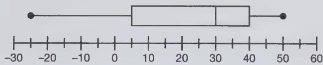

text_image

-30
-20
-10
0
10
20
30
40
50
60

a. 5   
b. 22.5   
c. 30   
d. 40   
e. 50

4. Solve the equation: 9 - x = -2(2x - 3)

a.-6   
b.-4   
c.-3   
d.-1   
e. 0

5. Brett can wash 2 full-length patio doors in 55 minutes. How many minutes would it take him to wash 17 full-length patio doors?   
6. The radius of the base of circular cylindrical holding tank is 8 times the radius of the base of a circular cylindrical pipe that empties into it. If they have the same length, say L feet, the volume of the tank is how many times the volume of the pipe?

a. 4

b. 8

c. 16

d. 64

e. 512

7. Which of the following is the solution set for the inequality $-4(3-2x) \geq 19 + 3(x-2)$ ?

a. $\{x \mid x \geq \frac{1}{11}\}$   
b. $\{x \mid x \geq 20\}$   
c. $\{x \mid x \geq -\frac{29}{5}\}$   
d. $\{x\mid x\geq -5\}$   
e. $\{x \mid x \geq 5\}$

8. Which of the following scatterplots indicates a positive trend?

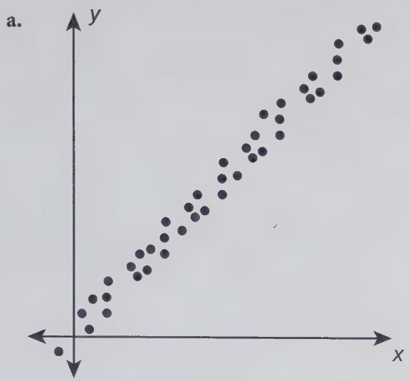

scatter

| x | y |
|---|---|
| 0.1 | 0.1 |
| 0.2 | 0.2 |
| 0.3 | 0.3 |
| 0.4 | 0.4 |
| 0.5 | 0.5 |
| 0.6 | 0.6 |
| 0.7 | 0.7 |
| 0.8 | 0.8 |
| 0.9 | 0.9 |
| 1.0 | 1.0 |

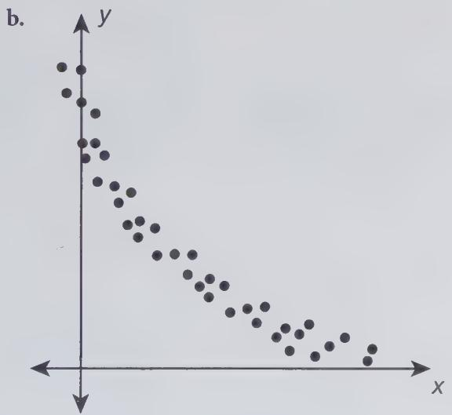

scatter

| x | y |
|---|---|
| 0.0 | 1.0 |
| 0.1 | 0.9 |
| 0.2 | 0.8 |
| 0.3 | 0.7 |
| 0.4 | 0.6 |
| 0.5 | 0.5 |
| 0.6 | 0.4 |
| 0.7 | 0.3 |
| 0.8 | 0.2 |
| 0.9 | 0.1 |
| 1.0 | 0.0 |

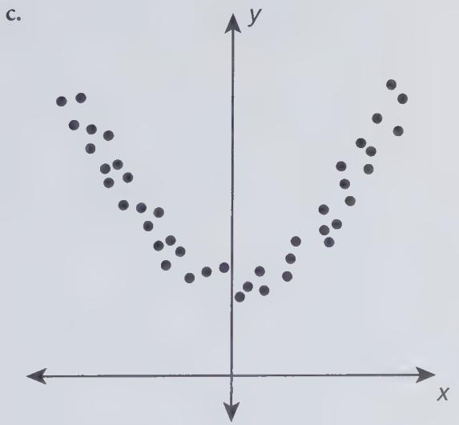

scatter

| x | y |
|---|---|
| 0.0 | 1.0 |
| 0.1 | 0.9 |
| 0.2 | 0.8 |
| 0.3 | 0.7 |
| 0.4 | 0.6 |
| 0.5 | 0.5 |
| 0.6 | 0.4 |
| 0.7 | 0.3 |
| 0.8 | 0.2 |
| 0.9 | 0.1 |
| 1.0 | 0.0 |

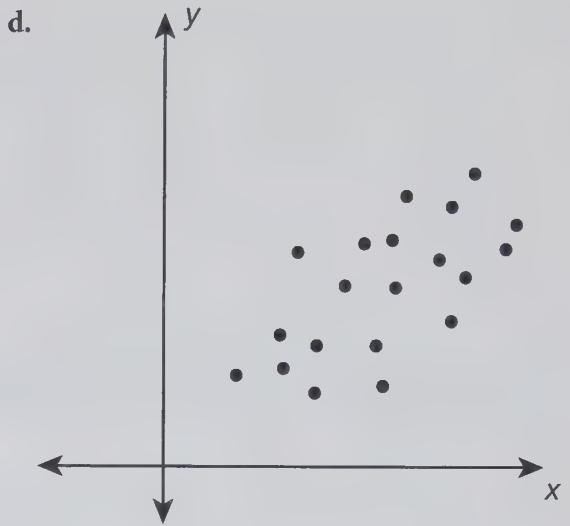

scatter

| x | y |
|---|---|
| 0.5 | 0.3 |
| 0.6 | 0.4 |
| 0.7 | 0.5 |
| 0.8 | 0.6 |
| 0.9 | 0.7 |
| 1.0 | 0.8 |
| 1.1 | 0.9 |
| 1.2 | 1.0 |
| 1.3 | 1.1 |
| 1.4 | 1.2 |
| 1.5 | 1.3 |
| 1.6 | 1.4 |
| 1.7 | 1.5 |
| 1.8 | 1.6 |
| 1.9 | 1.7 |
| 2.0 | 1.8 |
| 2.1 | 1.9 |
| 2.2 | 2.0 |
| 2.3 | 2.1 |
| 2.4 | 2.2 |
| 2.5 | 2.3 |
| 2.6 | 2.4 |
| 2.7 | 2.5 |
| 2.8 | 2.6 |
| 2.9 | 2.7 |
| 3.0 | 2.8 |
| 3.1 | 2.9 |
| 3.2 | 3.0 |
| 3.3 | 3.1 |
| 3.4 | 3.2 |
| 3.5 | 3.3 |
| 3.6 | 3.4 |
| 3.7 | 3.5 |
| 3.8 | 3.6 |
| 3.9 | 3.7 |
| 4.0 | 3.8 |
| 4.1 | 3.9 |
| 4.2 | 4.0 |
| 4.3 | 4.1 |
| 4.4 | 4.2 |
| 4.5 | 4.3 |
| 4.6 | 4.4 |
| 4.7 | 4.5 |
| 4.8 | 4.6 |
| 4.9 | 4.7 |
| 5.0 | 4.8 |
| 5.1 | 4.9 |
| 5.2 | 5.0 |
| 5.3 | 5.1 |
| 5.4 | 5.2 |
| 5.5 | 5.3 |
| 5.6 | 5.4 |
| 5.7 | 5.5 |
| 5.8 | 5.6 |
| 5.9 | 5.7 |
| 6.0 | 5.8 |
| 6.1 | 5.9 |
| 6.2 | 6.0 |
| 6.3 | 6.1 |
| 6.4 | 6.2 |
| 6.5 | 6.3 |
| 6.6 | 6.4 |
| 6.7 | 6.5 |
| 6.8 | 6.6 |
| 6.9 | 6.7 |
| 7.0 | 6.8 |
| 7.1 | 6.9 |
| 7.2 | 7.0 |
| 7.3 | 7.1 |
| 7.4 | 7.2 |
| 7.5 | 7.3 |
| 7.6 | 7.4 |
| 7.7 | 7.5 |
| 7.8 | 7.6 |
| 7.9 | 7.7 |
| 8.0 | 7.8 |
| 8.1 | 7.9 |
| 8.2 | 8.0 |
| 8.3 | 8.1 |
| 8.4 | 8.2 |
| 8.5 | 8.3 |
| 8.6 | 8.4 |
| 8.7 | 8.5 |
| 8.8 | 8.6 |
| 8.9 | 8.7 |
| 9.0 | 8.8 |
| 9.1 | 8.9 |
| 9.2 | 9.0 |
| 9.3 | 9.1 |
| 9.4 | 9.2 |
| 9.5 | 9.3 |
| 9.6 | 9.4 |
| 9.7 | 9.5 |
| 9.8 | 9.6 |
| 9.9 | 9.7 |
| -0   | -0   |
| -0   | -1   |
| -0   | -2   |
| -0   | -3   |
| -0   | -4   |
| -0   | -5   |
| -0   | -6   |
| -0   | -7   |
| -0   | -8   |
| -0   | -9   |
| -0   | -10   |
| -0   | -11   |
| -0   | -12   |
| -0   | -13   |
| -0   | -14   |
| -0   | -15   |
| -0   | -16   |
| -0   | -17   |
| -0   | -18   |
| -0   | -19   |
| -0   | -20   |
| -0   | -21   |
| -0   | -22   |
| -0   | -23   |
| -0   | -24   |
| -0   | -25   |
| -0   | -26   |
| -0   | -27   |
| -0   | -28   |
| -0   | -29   |
| -0   | -30   |
| -0   | -31   |
| -0   | -32   |
| -0   | -33   |
| -0   | -34   |
| -0   | -35   |
| -0   | -36   |
| -0   | -37   |
| -0   | -38   |
| -0   | -39   |
| -0   | -40   |
| -0   | -41   |
| -0   | -42   |
| -0   | -43   |
| -0   | -44   |
| -0   | -45   |
| -0   | -46   |
| -0   | -47   |
| -0   | -48   |
| -0   | -49   |
| -0   | -50   |
| -0   | -51   |
| -0   | -52   |
| -0   | -53   |
| -0   | -54   |
| -0   | -55   |
| -0   | -56   |
| -0   | -57   |
| -0   | -58   |
| -0   | -59   |
| -0   | -60   |
| -0   | -61   |
| -0   | -62   |
| -0   | -63   |
| -0   | -64   |
| -0   | -65   |
| -0   | -66   |
| -0   | -67   |
| -0   | -68   |
| -0   | -69   |
| -0   | -70   |
| -0   | -71   |
| -0   | -72   |
| -0   | -73   |
| -0   | -74   |
| -0   | -75   |
| -0   | -76   |
| -0   | -77   |
| -0   | -78   |
| -0   | -79   |
| -0   | -80   |
|

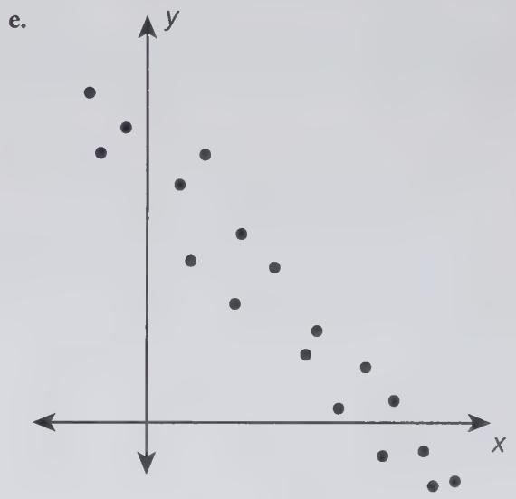

scatter

| x | y |
|---|---|
| 0.5 | 0.8 |
| 0.6 | 0.7 |
| 0.7 | 0.6 |
| 0.8 | 0.5 |
| 0.9 | 0.4 |
| 1.0 | 0.3 |
| 1.1 | 0.2 |
| 1.2 | 0.1 |
| 1.3 | 0.0 |
| 1.4 | -0.1 |
| 1.5 | -0.2 |
| 1.6 | -0.3 |
| 1.7 | -0.4 |
| 1.8 | -0.5 |
| 1.9 | -0.6 |
| 2.0 | -0.7 |
| 2.1 | -0.8 |
| 2.2 | -0.9 |
| 2.3 | -1.0 |
| 2.4 | -1.1 |
| 2.5 | -1.2 |
| 2.6 | -1.3 |
| 2.7 | -1.4 |
| 2.8 | -1.5 |
| 2.9 | -1.6 |
| 3.0 | -1.7 |
| 3.1 | -1.8 |
| 3.2 | -1.9 |
| 3.3 | -2.0 |
| 3.4 | -2.1 |
| 3.5 | -2.2 |
| 3.6 | -2.3 |
| 3.7 | -2.4 |
| 3.8 | -2.5 |
| 3.9 | -2.6 |
| 4.0 | -2.7 |
| 4.1 | -2.8 |
| 4.2 | -2.9 |
| 4.3 | -3.0 |
| 4.4 | -3.1 |
| 4.5 | -3.2 |
| 4.6 | -3.3 |
| 4.7 | -3.4 |
| 4.8 | -3.5 |
| 4.9 | -3.6 |
| 5.0 | -3.7 |
| 5.1 | -3.8 |
| 5.2 | -3.9 |
| 5.3 | -4.0 |
| 5.4 | -4.1 |
| 5.5 | -4.2 |
| 5.6 | -4.3 |
| 5.7 | -4.4 |
| 5.8 | -4.5 |
| 5.9 | -4.6 |
| 6.0 | -4.7 |
| 6.1 | -4.8 |
| 6.2 | -4.9 |
| 6.3 | -5.0 |
| 6.4 | -5.1 |
| 6.5 | -5.2 |
| 6.6 | -5.3 |
| 6.7 | -5.4 |
| 6.8 | -5.5 |
| 6.9 | -5.6 |
| 7.0 | -5.7 |
| 7.1 | -5.8 |
| 7.2 | -5.9 |
| 7.3 | -6.0 |
| 7.4 | -6.1 |
| 7.5 | -6.2 |
| 7.6 | -6.3 |
| 7.7 | -6.4 |
| 7.8 | -6.5 |
| 7.9 | -6.6 |
| 8.0 | -6.7 |
| 8.1 | -6.8 |
| 8.2 | -6.9 |
| 8.3 | -7.0 |
| 8.4 | -7.1 |
| 8.5 | -7.2 |
| 8.6 | -7.3 |
| 8.7 | -7.4 |
| 8.8 | -7.5 |
| 8.9 | -7.6 |
| 9.0 | -7.7 |
| 9.1 | -7.8 |
| 9.2 | -7.9 |
| 9.3 | -8.0 |
| 9.4 | -8.1 |
| 9.5 | -8.2 |
| 9.6 | -8.3 |
| 9.7 | -8.4 |
| 9.8 | -8.5 |
| 9.9 | -8.6 |
| 10.0 | -8.7 |

9. Which of the following is a reasonable estimate for the height of the first hill of a new extreme roller coaster?

a. 2,000 mm   
b. 8 m   
c. 300 ft.   
d. 2.0 km   
e. 5 yards

10. Participants in a study concerned with the link between eating sugary foods and blood glucose levels are asked to measure their glucose levels every 4 hours during the day. One participant's readings for the first 24 hours of the study are as follows:

<table><tr><td>TIME</td><td>BLOOD GLUCOSE LEVEL(IN MILLIGRAMS PER DECILITER)</td></tr><tr><td>6 A.M.</td><td>50</td></tr><tr><td>10 A.M.</td><td>70</td></tr><tr><td>2 P.M.</td><td>50</td></tr><tr><td>6 P.M.</td><td>40</td></tr><tr><td>10 P.M.</td><td>60</td></tr><tr><td>2 A.M.</td><td>60</td></tr></table>

What is the mean blood glucose level for these readings?

11. What is the slope of the line graphed here?

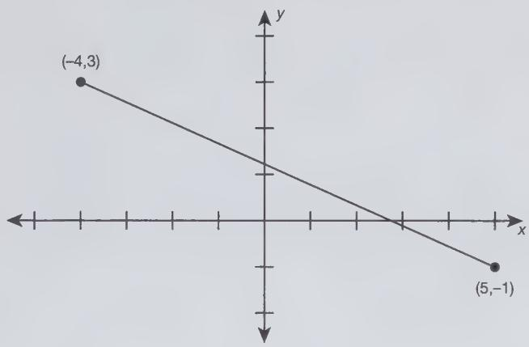

line

| Point | x | y |
|---|---|---|
| (-4,3) | -4 | 3 |
| (5,-1) | 5 | -1 |

a. 2

b. $\frac{4}{9}$

c. 0

d. $-\frac{4}{9}$

e. $-\frac{9}{4}$

12. Which of the following are factors of the number $2^{3} \times 3^{2} \times 5$ ? Select all that apply.

a. 4

b. 7

c. 12

d. 50

e. 72

13. Pamela works a 40-hour week as a computer technician at a local library. She earns a base salary of \$15 per hour, plus double this amount for any hour she works beyond 40 in a week. Her goal is to earn \$960 each week prior to taxes. How many hours beyond the initial 40 must she work in a week to attain her goal?

14. An eighth-grade teacher needs to select a student representative to serve as an assistant crossing guard for after-school programs. To do this, she randomly selects a letter from the alphabet and then chooses the first student from the bottom of her class roster whose first name begins with that letter. Which of the following statements is true?

a. The selection process is unfair because there may not be an equal number of students whose first names start with each letter of the alphabet.

b. The selection process is unfair because she did a random selection of letters instead of numbers.

c. The selection process is fair because each letter has an equal chance of being selected.

d. The selection process is fair because students with an uncommon first name will not be singled out.

e. This would be a fair method for making such a selection if the class size were 60, but not for a class size of 25.

15. If the triangle $\Delta ABC$ with vertices $A(3,-5)$ , $B(-4,4)$ , and $C(-6,3)$ is reflected over the line y = -1, what are the coordinates of the image of vertex C?

a. $(3,-6)$   
b. $(4,-5)$   
c. (4,3)   
d. (6,-3)   
e. $(-6,-5)$

16. Consider the following relative frequency distribution:

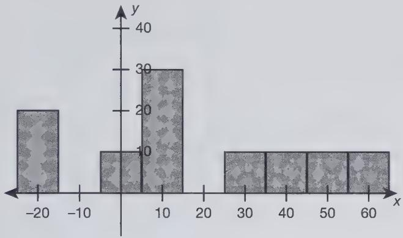

histogram

| x | y |
|---|---|
| -20 | 20 |
| -10 | 0 |
| 10 | 30 |
| 20 | 0 |
| 30 | 10 |
| 40 | 10 |
| 50 | 10 |
| 60 | 10 |

Select all statements that are true.

a. The standard deviation is zero.   
b. The distribution is symmetric about the y-axis.   
c. The median of this distribution is positive.   
d. The distribution is skewed right.   
e. The distribution is bimodal.

17. Which of the following is equivalent to

$$
2 4 a ^ {3} b ^ {5} - 8 a ^ {4} b ^ {2} + 3 6 a b ^ {3} - a ^ {4} b ^ {2}?
$$

a. $55a^{12}b^{12}$   
b. $3ab^{2}(8a^{2}b^{3}-9a^{4}b^{2}+36ab^{3})$

c. $9ab^{2}(3a^{2}b^{3}+4b-1)$

d. $60a^{3}b^{5} - 9a^{4}b^{2}$

e. $3ab^{2}(8a^{2}b^{3}-3a^{3}+12b)$

18. Which of the following is equivalent to $\frac{30\sqrt{24}}{6\sqrt{3}}$ ?

a. $5\sqrt{21}$

b. $20\sqrt{3}$

c. $5\sqrt{2}$

d. $10\sqrt{2}$

e. 20

19. Consider the following set of numbers:

{6, 16, 26, 36, 46, 56, 66, 108}

If a number is selected at random from this set, what is the probability of selecting a number that is divisible by 6 and 9?

a. 0.125

b. 0.25

c. 0.50

d. 0.75

e. 1.00

20. The group exercise classes at a local YMCA begin at 7 A.M. and the last class ends at 3:56 P.M. There are 10 classes offered with 4 minutes between classes. What is the duration of each class, in minutes?

21. Corn is being poured out of a silo into a pile in the form of a right circular cone. If the height of the final pile is 12 feet and the volume is $324\pi$ cubic feet, what is the radius of the circular base (in feet)?

22. Let $m(x) = -5x + 4x^{3} - 3x^{4}$ and $n(x) = 6x^{3} - 2x^{4}$ . Which of the following is equivalent to $4m(x) - 3n(x)$ ?

a. $-x(5x^{3} + 14x^{2} + 20)$

b. $-2x(3x^{3} + x^{2} + 10)$

c. $-2x(9x^{3} + x^{2} + 10)$

d. $-2x(9x^{3} - 17x^{2} + 10)$

e. $-x(x^{3} + 2x^{2} + 5)$

23. Two hundred parents and students in the audience of a high school freshmen orientation session were asked if they had ever heard of the concept of student-centered learning. The responses are tabulated as follows:

<table><tr><td></td><td>PARENTS</td><td>STUDENTS</td></tr><tr><td>Yes</td><td>12</td><td>32</td></tr><tr><td>No</td><td>118</td><td>38</td></tr></table>

What is the probability that a randomly selected member of the audience answers Yes to this question given that the audience member is a parent?

a. $\frac{3}{50}$   
b. $\frac{6}{65}$   
c. $\frac{3}{11}$   
d. $\frac{16}{35}$   
e. 12

24. A dog boarding facility devotes $\frac{4}{5}$ of its time to dog grooming services. Of this time, $\frac{7}{24}$ is spent on bathing dogs. What fraction of its dog-grooming time does this facility NOT devote to bathing dogs?   
25. Which of the following quadratic equations has imaginary solutions? Select all that apply.

a. $6x^{2}-42=0$

b. $3x^{2} + x + 8 = 0$

c. $4x^{2} + 20 = 0$

d. $-8x^{2}+40x=0$

e. $x^{2} + 11x + 4 = 0$

26. A family goes to an apple orchard to pick apples for autumn baking. The cost for the excursion is a \$7.50 entrance fee plus \$5.00 per pound of apples. If they want to spend no more than \$50, which of the following inequalities can be used to determine the number of pounds of apples, x, they can purchase?

a. $5.00x + 7.50 \leq 50.00$   
b. 5.00 + 7.50x ≤ 50.00   
c. 5.00x + 7.50 ≥ 50.00   
d. $5.00 + 7.50x \geq 50.00$   
e. 12.50x ≤ 50.00

27. A zip line extends from peak to peak, as shown in the diagram.

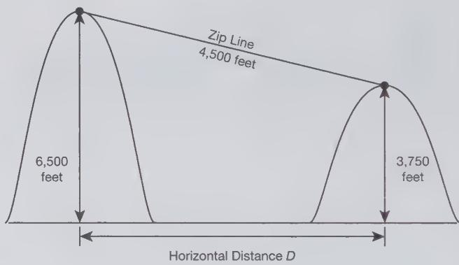

line

| Horizontal Distance D | Vertical Distance |
| --------------------- | ----------------- |
| 6,500 feet            | 4,500 feet        |
| 3,750 feet            | 3,750 feet        |

The length of the zip line is 4,500 feet. The height of the higher peak is 6,500 feet and the height of the lower one is 3,750 feet. What is the approximate horizontal distance between the two peaks?

a. 750 feet   
b. 3,562 feet   
c. 4,500 feet   
d. 5,858 feet   
e. 8,250 feet

28. Which of the following is equivalent to the expression $(3g^{2}h) \cdot (2j^{3}gh^{5})$ ?

a. $72g^{3}h^{6}j^{3}$

b. $6g^{2}h^{5}j^{3}$

c. $6(gh^{6}j)^{3}$

d. $g^{3}h^{6}j^{3}$

e. $6g^{3}h^{6}j^{3}$

29. The top of a giant gumball machine is a spherical glass globe with a diameter of 3 feet. What is the volume of the tank in cubic inches?

a. 1,296π cubic inches

b. 1,944π cubic inches

c. 5,184π cubic inches

d. 7,776π cubic inches

e. 62,208π cubic inches

30. Which of the following is the solution of this system of equations?

$$
\left\{ \begin{array}{l} 2 x - 3 y = 2 1 \\ 3 y + 2 x = 2 7 \end{array} \right.
$$

a. $x = -\frac{3}{2}$ , y = -8

b. x = 0, y = -7

c. $x = 12, y = 1$

d. $x = 0, y = 9$

e. no solution

31. Assume that the line passing through points $A$ and $C$ is tangent to the circle (centered at point $B$ ) at point $A$ , as shown:

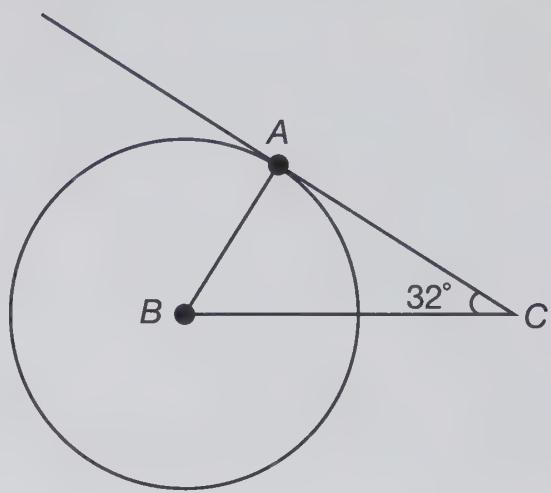

text_image

A
B
32°
C

What is the measure of angle $ABC$ in degrees?

32. Suppose that a random variable $X$ has the following probability distribution:

<table><tr><td>x</td><td>-6</td><td>-2</td><td>0</td><td>3</td><td>5</td></tr><tr><td>P(X=x)</td><td> $\frac{3}{2}$ </td><td> $\frac{2}{9}$ </td><td> $\frac{1}{6}$ </td><td> $\frac{7}{18}$ </td><td> $\frac{1}{6}$ </td></tr></table>

What is the expected value of $X$ ?

a.-6

b. 0

c. .1

d. $\frac{11}{9}$

e. 3

33. On an amusement park map, 1 inch corresponds to 750 feet. If the length of the path from the Looper Dooper Coaster to the Over the Falls Flume Ride on the map is 3.8 inches, what is the actual distance between these amusement rides?

a. 197.4 feet   
b. 753.8 feet   
c. 1,508 feet   
d. 2,850 feet   
e. cannot determine from the given information

34. Which of the following equations has solutions that correspond to the intersection points of the graph?

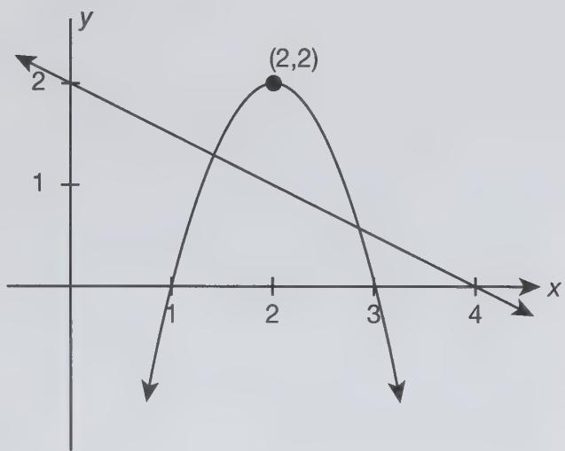

line

| Point | x | y |
|-------|---|---|
| (2,2) | 2 | 2 |
| (1,1) | 1 | 1 |
| (3,0) | 3 | 0 |
| (4,0) | 4 | 0 |

a. $2(x - 2)^{2} = -\frac{1}{2} x$   
b. $-2(x-2)^{2}=-\frac{1}{2}x$   
c. $-(x - 2)^{2} + 2 = -2x + 2$   
d. $(x - 2)^{2} = x$   
e. $-(x-2)^{2}+2=-\frac{1}{2}x+4$

35. Nathan spent \$1,175 on equipment needed to start a power-washing business. For each deck or fence he power-washes, he earns \$50, but it costs \$6.50 in gas for each job. Determine the number of decks or fences he must power-wash to break even.

a. 21   
b. 24   
c. 27   
d. 28   
e. 54

36. A professional racquetball player can return a ball at 70 miles per hour. Which numerical expression gives the speed of his return in feet per second?

a. $\frac{70 \times 5,280}{60 \times 60}$ feet per second   
b. $\frac{70\times5,280}{60}$ feet per second   
c. $\frac{70 \times 60 \times 60}{5,280}$ feet per second   
d. $\frac{70}{60}$ feet per second   
e. $\frac{70}{60 \times 60}$ feet per second

37. Suppose that $f$ is an invertible function with the following values:

<table><tr><td>x</td><td>-6</td><td>-5</td><td>-2</td><td>0</td><td>3</td><td>8</td></tr><tr><td>f(x)</td><td>3</td><td>8</td><td>6</td><td>4</td><td>-2</td><td>-6</td></tr></table>

What is the value of the expression $f^{-1}(f^{-1}(-6))$ , where $f^{-1}$ represents the inverse function of f?

38. Write the following product as a decimal:

$$
(3 0. 5 \times 1 0 ^ {4}) \times (1. 2 \times 1 0 - 7)
$$

39. Consider the line graphed here:

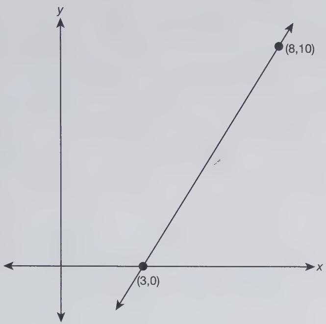

line

| Point | x | y |
|---|---|---|
| (3,0) | 3 | 0 |
| (8,10) | 8 | 10 |

Which of the following is the equation of this line?

a. 2x - y = 3

b. x - 2y = 3

c. $2x + 3y = 6$

d. 2x - y = 6

e. 2x - y = -3

40. The height of a scuba training pool in the shape of a right circular cylinder is three times the diameter of the base. If the diameter of the base of the cylinder is 60 feet, what is its volume?

a. 10,800π cubic feet

b. 54,000π cubic feet

c. 162,000π cubic feet

d. 648,000π cubic feet

e. 1,944,000π cubic feet

41. Assume the point $(-1,6)$ lies on the graph of the function $y = f(x)$ . Consider the translation of this function given by $g(x) = f(x - 7) + 2$ . To what point would the given point correspond on the graph of $g(x)$ ?

42. A tent is in the shape of a right triangular prism with dimensions shown:

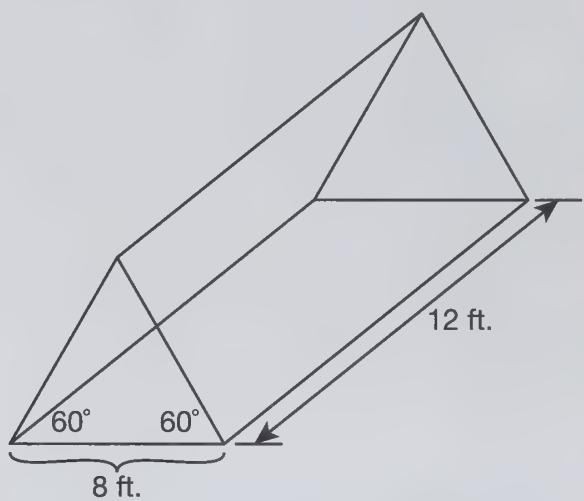

text_image

60°
60°
8 ft.
12 ft.

What is its total surface area?

a. $(288+32\sqrt{3})$ ft. $^{2}$

b. $192\sqrt{3}$ ft. $^{2}$

c. $(192 + 32\sqrt{3})$ ft. $^{2}$

d. $(96 + 32\sqrt{3})$ ft. $^{2}$

e. $(288 + 16\sqrt{3})$ ft. $^{2}$

43. If $p$ and $q$ are prime numbers, what is the greatest common factor of $18p^2q$ , $30pq^2$ , $12pq^3$ ?

a. $180p^{2}q^{3}$

b. $12pq^{2}$

c. 3pq

d. $2,880p^{4}q^{6}$

e. 6pq

44. Which of the following collections of data, if any, has/have a median and a mean of 26?

I. 26, 26, 0, 26, 26

II. -22, 98, -22, 98, -22

III. 26, 26, 26, 26

a. I only

b. II only

c. III only

d. I and II

e. I, II, and III

45. Which of the following is equivalent to $\frac{32x-8}{4x^{2}-1} \div \frac{16x^{2}-4x}{2x-1}$ ?

a. $\frac{2}{2x^{2}+x}$

b. $\frac{2}{2x^{2}+1}$

c. $\frac{1}{x^{2}+x}$

d. $\frac{1}{x^{2}+1}$

e. $\frac{2}{2x^{2}-x}$

46. Which of the following distributions has a positive median? Select all that apply.

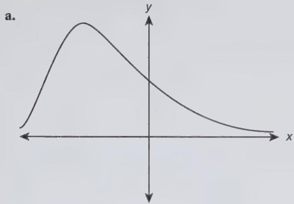

text_image

a.
y
x

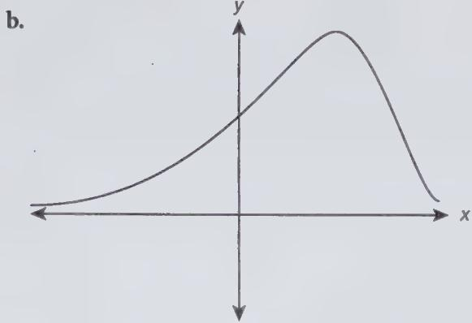

text_image

b.
y
x

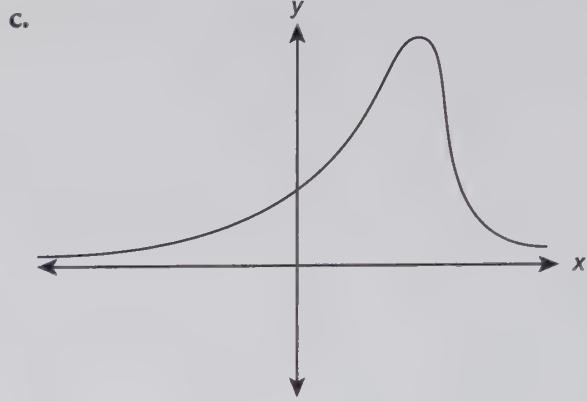

text_image

C.
y
x

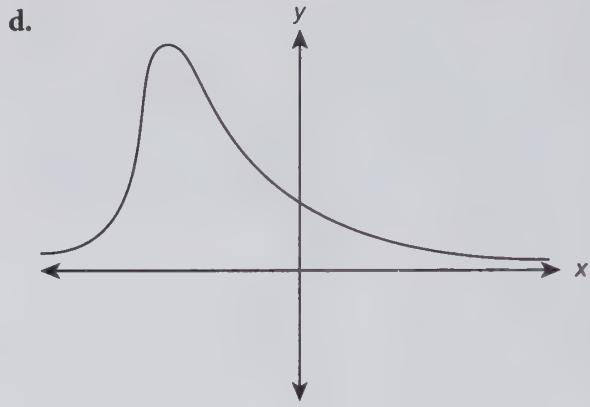

line

| x    | y     |
| ---- | ----- |
| 0    | 0     |
| Peak | High  |
| Right Y | Low   |

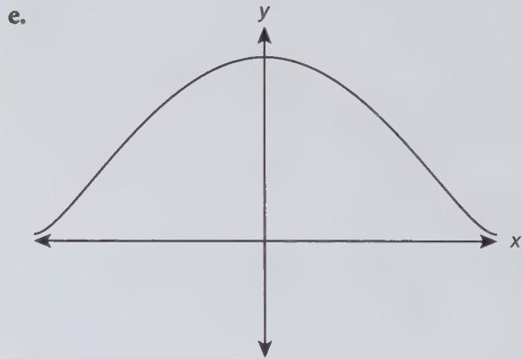

text_image

e.
y
x

47. Assume that $a$ and $b$ are positive integers. Which of the following statements is/are always true?

I. $\frac{a}{a + b} = \frac{1}{b}$

II. $a \times b > a$

III. $\frac{b}{a} +\frac{a}{b} = \frac{b^2 + a^2}{a\times b}$

a. I and II only

b. II and III only

c. I only

d. II only

e. III only

48. Consider the two squares ABCD and LMNP:

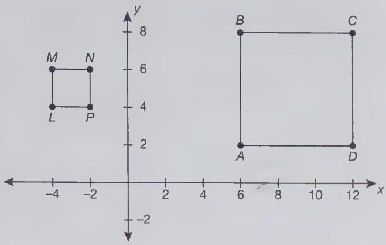

text_image

M N
L P
-4 -2 8 6 4 2 1 0 2 4 6 8 10 12 x
-2

Assume that ABCD can be transformed into LMNP by first translating ABCD and then applying an appropriate dilation emanating from the lower left vertex of the square. Which of the following translation rule–dilation combinations will result in this transformation?

a. Translate using the rule $(x,y)\rightarrow(x+10,y-2)$ and then perform a dilation centered at the vertex A with a scale factor of 3.

b. Translate using the rule $(x,y)\rightarrow(x-10,y-2)$ and then perform a dilation centered at the vertex A with a scale factor of 3.

c. Translate using the rule $(x,y)\rightarrow(x-10,y+2)$ and then perform a dilation centered at the vertex A with a scale factor of $\frac{1}{3}$ .

d. Translate using the rule $(x,y)\rightarrow(x-4,y+2)$ and then perform a dilation centered at the vertex A with a scale factor of 3.

e. Translate using the rule $(x,y)\rightarrow(x+10,y-2)$ and then perform a dilation centered at the vertex A with a scale factor of $\frac{1}{3}$ .

49. A certain probability model suggests that when a standard 8-sided die is rolled, the probability of it landing with the 4 side up is $\frac{1}{8}$ . Select all the following statements that are true.

a. In the long run, you expect to have the die land on a 4 one-eighth of the time.

b. If you roll ten consecutive 4s, the probability model must be invalid.

c. It is impossible to roll the die 100 times and get only five 4s.

d. It is possible to roll 20 consecutive 4s.

e. It is possible to roll the die 50 times and get one 4, and to roll it another 50 times and get thirty 4s without violating this model.

50. Jacob needs to build five identical, adjacent rectangular pens in the backyard in such a way that the backside of all five pens is against the barn, as shown.

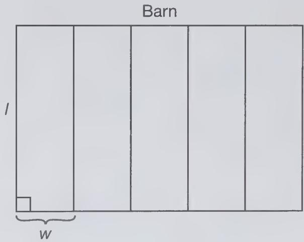

text_image

Barn
I
w

He has 1,200 feet of fence to use to construct the pens. Fence is not needed along the backside of the barn. If the combined area of all five pens must be 70,000 square feet, create a quadratic equation that can be used to find the width, w, of one of the five pens.

51. Which of the following statements is/are true? Select all that apply.

a. The square root of a rational number must be irrational.

b. The quotient of two nonzero rational numbers can be an irrational number.

c. The product of two irrational numbers can be a rational number.

d. The sum of an irrational number and a rational number must be an irrational number.

e. The quotient of two irrational numbers can be irrational.

52. What is the value of $x$ in the following diagram? Assume $O$ is the center of the circle and that $OP$ and $OK$ are both radii of this circle.

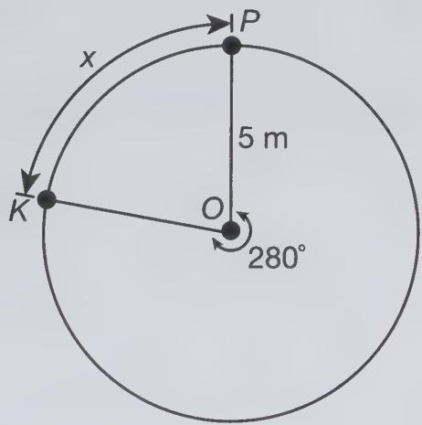

text_image

x
5 m
280°
K
O
P

53. Which of the following is equivalent to

$$
\frac {2}{(x + 1) ^ {2}} \div \frac {x}{x + 1}?
$$

a. $\frac{1-x}{x+1}$

b. $\frac{2-x}{(x+1)^{2}}$

c. $\frac{-(x+2)}{x+1}$

d. $\frac{1-x}{(x+1)^{2}}$

e. $\frac{-(x-1)(x+2)}{(x+1)^{2}}$

54. Consider the set of whole numbers $\{6, 12, 18, 24, \ldots\}$ . Select all of the following statements that are true about the members of this set.

a. None of the numbers are prime.   
b. All the numbers are divisible by 4.   
c. None of the numbers are odd.   
d. All the numbers are multiples of 6.   
e. All the numbers are factors of 6.

55. A great room measures 18 feet by 22 feet and the ceiling is 10 feet high. One gallon of paint can be used to apply one coat of paint to 300 square feet of wall or ceiling space. How many gallons of paint will it take to paint all but the floor of the room if three coats of paint must be applied? Round your answer to the nearest tenth of a foot.   
56. Which of the following statements is/are true? Select all that apply.

a. $\sqrt{9} +\sqrt{16} = \sqrt{25}$

b. $\sqrt{\frac{1}{5}} = \frac{\sqrt{5}}{5}$

c. e = 2.71828

d. π = 314159

e. $\sqrt{\frac{1}{5}} > \sqrt{\frac{1}{7}}$

# Praxis® Core Academic Skills for Educators: Mathematics Practice Test 1 Answers and Explanations

1. c. Observe that $\sqrt{500} = \sqrt{10 \times 10 \times 5} = 10\sqrt{5}$ .   
Choice a is incorrect because 50 squared does not equal 500, so $\sqrt{500}$ cannot equal 50. Choice b is incorrect because $10\sqrt{50} = \sqrt{10 \times 10 \times 50} = \sqrt{5,000}$ , not $\sqrt{500}$ . Choice d is incorrect because $50\sqrt{10} = \sqrt{50 \times 50 \times 10} = \sqrt{25,000}$ , not $\sqrt{500}$ . Choice e is incorrect because the 5 and 10 are switched.

2. 25,611,100. Let x represent the expected number of births. Set up the following proportion:

$$
\frac {1 9 . 3}{1 , 0 0 0} = \frac {x}{1 , 3 2 7 , 0 0 0 , 0 0 0}
$$

Solving for $x$ yields

$$
1, 0 0 0 x = (1 9. 3) (1, 3 2 7, 0 0 0, 0 0 0)
$$

$$
x = \frac {(1 9 . 3) (1 , 3 2 7 , 0 0 0 , 0 0 0)}{1 , 0 0 0}
$$

$$
x = 2 5, 6 1 1, 1 0 0
$$

3. c. The median is depicted in a boxplot as the vertical line segment occurring within the box portion of the plot itself. Here, that line occurs at the value 30. So, the median of the data set is 30. Choice a is incorrect because it represents the 25th percentile, not the median. Choice b is incorrect because although 22.5 is the midpoint between the outer boundaries of the box (which occur at 5 and 40), it is not the center of the data set. The vertical line contained within the box depicts the median of the data set. Choice d is incorrect because it represents the 75th percentile, not the median. Choice e is incorrect because this is the maximum value of any data point in the data set, not the middle (or median) of the data set.

4. d. Use the distributive property on the right side. Then, gather all x-terms on the left side and the constant terms on the right, combine like terms, and finally divide both sides by the coefficient of x, as follows:

$$
9 - x = - 2 (2 x - 3)
$$

$$
9 - x = - 4 x + 6
$$

$$
4 x - x = 6 - 9
$$

$$
3 x = - 3
$$

$$
x = - 1
$$

Choice a is incorrect because when solving for x, you divide both sides by its coefficient, you do not subtract it from both sides. Choice b is incorrect because you did not distribute the -2 to both terms within the parentheses on the right side. Choice c is incorrect because you did not divide both sides by 3 in the last step. Choice e is incorrect because you added coefficient of x to both sides in the last step instead of dividing both sides by it.

5. 467.5 minutes. Let x represent the number of minutes needed to wash 17 full-length patio doors. Set up the following proportion:

$$
\frac {2 \text {   patio   doors }}{5 5 \text {   minutes }} = \frac {1 7 \text {   patio   doors }}{x \text {   minutes }}
$$

Cross multiply and solve for x:

$$
2 x = (1 7) (5 5)
$$

$$
2 x = 9 3 5
$$

$$
x = 4 6 7. 5
$$

So, it would take Brett 467.5 minutes to wash 17 full-length patio doors.

6. d. Let $R$ be the radius of the base of the pipe. Then, the radius of the base of the tank is $8R$ . The volume of the pipe is $\pi R^2 L$ , while the volume of the tank is $\pi (8R)^2 L = 64\pi R^2 L$ . So, the volume of the tank is 64 times the volume of the pipe. Choice a is incorrect because you took one-half of the radius instead of squaring it when computing the volume of the tank. Choice b is incorrect because you forgot to square the 8 when computing the volumes of the pipe and tank. Choice c is incorrect because when squaring $8R$ , you mistakenly multiplied 8 by 2 instead of raising 8 to the second power. Note that $8^2 = 64$ , not 16. Choice e is incorrect because you cubed the radius when computing the volumes of the pipe and tank, but should have squared it.

7. e. To solve this inequality, use the distributive properties on both sides of the inequality. Then, combine like terms on each side. Take the $x$ -terms to the left and the constants to the right and combine like terms again. Then, divide both sides by the coefficient of $x$ :

$$
\begin{array}{l} - 4 (3 - 2 x) \geq 1 9 + 3 (x - 2) \\ - 1 2 + 8 x \geq 1 9 + 3 x - 6 \\ - 1 2 + 8 x \geq 1 3 + 3 x \\ 5 x \geq 2 5 \\ x \geq 5 \\ \end{array}
$$

So, the solution set is $\{x \mid x \geq 5\}$ . Choice a is incorrect because when gathering the x-terms on one side and the constant on the other side of inequality, you add the opposite of a term to one side, not the term itself. Choice b is incorrect because in the last step, instead of dividing both sides by 5, you subtracted 5 from both sides. Choice c is incorrect because you did not apply the distributive property correctly. Choice d is incorrect because you made a sign error when balancing the equation.

8. a. The points rise from left to right in this scatterplot, which indicates a positive trend. Choice b is incorrect because the points follow a nonlinear graph on which the points fall from left to right, which indicates a negative trend. Choice c is incorrect because while the correlation is very strong (and nonlinear), part of the time the points fall from left to right, and part of the time they rise from left to right; so the trend is not positive. Choice d is incorrect because while the points are all above the x-axis, so that the y-values are all positive, there is no discernible trend, positive or negative, apparent in the scatterplot. Choice e is incorrect because this is a loose negative trend since the points tend to fall from left to right.

9. c. Of all the choices listed, this is by far the most reasonable. Choice a is incorrect because 2,000 mm is equivalent to 20 cm, which is less than 1 foot. Choice b is incorrect because 8 meters is about 24 feet, which may be fine for a kiddie coaster, but not an extreme roller coaster. Choice d is incorrect because this exceeds one mile, which is way too high. Choice e is incorrect because this is 15 feet, which may be fine for a kiddie coaster, but not an extreme roller coaster.

10. 55 milligrams per deciliter. Add the six measurements and divide the sum by 6 to get $\frac{330}{6} = 55$ milligrams per deciliter.

11. d. Use the two labeled points $(-4,3)$ and $(5,-1)$ to compute the slope:

$$
m = \frac {3 - (- 1)}{- 4 - 5} = \frac {4}{- 9} = - \frac {4}{9}
$$

Choice a is incorrect because you added the y-values and the x-values when forming the numerator and denominator, respectively, of the slope, but you should compute the differences. Choice b is incorrect because the sign is wrong. Be certain to subtract the y-values and the x-values in the same order when computing the slope. Choice c is incorrect because the slope cannot be 0 since the line is not horizontal. Choice e is incorrect because this is the reciprocal of the slope; remember, the slope of a line is the change in y-values divided by the change in x-values.

12. a, c, and e. A factor of a whole number must divide it evenly. Observe that $4 = 2^{2}$ , which divides $2^{3}$ evenly;

$12 = 2^{2} \times 3$ , which divides $2^{3} \times 3^{2}$ evenly; and $72 = 2^{3} \times 3^{2}$ , which clearly divides $2^{3} \times 3^{2}$ evenly. Choice b is not a correct selection because 7 is not a prime factor listed in the given product and so cannot divide it evenly. Choice d is not a correct selection because $50 = 2 \times 5^{2}$ , which has one more factor of 5 than occurs in the given product, so it cannot divide it evenly.

13. 12 hours. Let x be the number of hours beyond 40 that Pamela must work to attain her goal. Her salary for the first 40 hours is $40(15) = 600$ dollars. Since she earns double per hour beyond 40 hours, her salary for working x hours beyond 40 is 30x dollars. The sum of these two dollar amounts must equal 960. This yields the equation $600 + 30x = 960$ . Solve for x as follows:

$$
6 0 0 + 3 0 x = 9 6 0
$$

$$
3 0 x = 3 6 0
$$

$$
x = 1 2
$$

So, Pamela must work 12 hours beyond the initial 40 to reach her earning goal.

14. a. A fair selection would result in each student having an equal chance of being selected.

However, if 6 students have first names starting with the letter M, while 14 have first names starting with the letter B, then students do not have an equal chance of being selected. Choice b is incorrect because random selection can be done with letters or numbers or without any assignment of either depending on the method used.

Choice c is incorrect because while each letter has an equal chance of being selected, the goal is to select a student, and the number of first names beginning with each letter can be, and likely are, different. Choice d is incorrect because to be fair, each student should have an equal chance of being selected whether his or her name is common or not. Choice e is incorrect because the size of the class is not the deciding criterion on fairness of the method. This issue is that there may not be an equal number of students whose first names begin with each letter.

15. e. When reflecting a point across the line y = -1, the x-coordinate will stay the same, but the y-coordinate will change. You subtract 3 - (-1) = 4 and add this to -1 to get the new y-coordinate. So, the image of vertex C is (-6, -5). Choice a is incorrect because this is the image across the line y = x. Choice b is incorrect because while the y-coordinate is correct, the x-coordinate should not change when reflecting across the line y = -1. Choice c is incorrect because this is the image across the line x = -1, not y = -1. Choice d is incorrect because this is the image across the origin, meaning that it is reflected about the y-axis and then the x-axis.

16. c and d. Choice a is not a correct selection because the only way the standard deviation can be zero is if there is a single data value, which is not the case here. Choice b is not a correct selection because if you fold the distribution over the y-axis, the graph does not line up, so it is not symmetric. Choice c is a correct selection because the median is the data value that divides the data in half. In this distribution, the data value that does this occurs within the bar on the 10, which is positive. Choice d is a correct selection because the bulk of the data is to the right of the data value 10. Choice e is not a correct selection because there are 5 data values with the same relative frequency.   
17. e. First, combine the second and fourth terms since they have the same variable part (and so are like terms): $24a^{3}b^{5}-9a^{4}b^{2}+36ab^{3}$ . Now, factor out the greatest common factor $3ab^{2}$ from all terms to get: $3ab^{2}(8a^{2}b^{3}-3a^{3}+12b)$ . Choice a is incorrect because you cannot add all four terms together like this. When monomials have the same variable part, you can add/subtract their coefficients. If they do not have the exact same variable part, you cannot combine them. Choice b is incorrect because when you factor out a greatest common factor, you must do so from all terms, not just the first one in an expression. Choice c is incorrect because 9 is not a common factor of all terms in the simplified expression $24a^{3}b^{5}-9a^{4}b^{2}+36ab^{3}$ . Choice d is incorrect because you cannot combine the first and third terms of the given expression since their variable parts are different.

18. d. Use the properties of radicals, together with the way fractions are multiplied, to simplify the expression:

$$
\begin{array}{l} \frac {3 0 \sqrt {2 4}}{6 \sqrt {3}} = \frac {3 0}{6} \cdot \frac {\sqrt {2 4}}{\sqrt {3}} \\ = 5 \cdot \sqrt {\frac {2 4}{3}} \\ = 5 \sqrt {8} \\ = 5 \sqrt {4 \cdot 2} \\ = 5 \sqrt {4} \cdot \sqrt {2} \\ = 5 \cdot 2 \cdot \sqrt {2} \\ = 1 0 \sqrt {2} \\ \end{array}
$$

Choice a is incorrect because you subtracted the radicands instead of dividing them.

Remember, $\frac{\sqrt{a}}{\sqrt{b}} = \sqrt{\frac{a}{b}}$ . Choice b is incorrect because you cannot cancel the 6 in the denominator with the 24 in the radicand in the numerator. Choice c is incorrect because you did not simplify $\sqrt{8}$ correctly. Choice e is incorrect because you cannot cancel the 3 in the denominator with the 30 in the radicand in the numerator, and you cannot cancel the 6 in the denominator with the 24 in the radicand in the numerator.

19. b. A number is divisible by 6 if it is even and its digit sum is divisible by 3. The numbers in the set for which this is true are 6, 36, 66, and 108. A number is divisible by 9 if its digit sum is divisible by 9. The numbers in the set for which this is true are 36 and 108. So, the probability that a number selected randomly from this set satisfies both conditions is $\frac{2}{8} = \frac{1}{4}$ , or 0.25. Choice a is incorrect because it represents $\frac{1}{8}$ . There are 2 numbers divisible by 6 and 9: 36 and 108. Choice c is incorrect because this is the probability that the number selected is divisible by 6; you did not account for the fact that it must also be divisible by 9. Choice d is incorrect because this is the probability of the complement of the event. Choice e is incorrect because this would mean all members of the set are divisible by 6 and 9. But 26 is divisible by neither of these, for instance.   
20. 50 minutes. The amount of time between 7 A.M. and 3:56 P.M. is 8 hours 56 minutes, which equals $8(60) + 56 = 536$ minutes. Since there are 10 classes, we must subtract 4 minutes times 9 to account for the time between consecutive classes. This gives 36 minutes. Subtracting this from 536 gives 500 minutes, which is evenly divided among 10 classes. This means each class lasts 50 minutes.   
21. 9 feet. The volume of a right circular cone with radius r and height h is given by the formula $V = \frac{1}{3}\pi r^{2}h$ . Substituting h = 12 and $V = 324\pi$ yields the equation $\frac{1}{3}\pi \cdot 12 \cdot r^{2} = 324\pi$ . Solving for $r^{2}$ yields $4\pi \times r^{2} = 324\pi$ , or $r^{2} = 81$ . So, r = 9 feet.

22. b. To compute $4m(x) - 3n(x)$ , first distribute 4 through each term of $m(x)$ and distribute the 3 through each term of $n(x)$ , and then add like terms. Finally, factor out the greatest common factor from all terms.

$$
\begin{array}{l} 4 m (x) - 3 n (x) = 4 \left(- 5 x + 4 x ^ {3} - 3 x ^ {4}\right) - 3 \left(6 x ^ {3} - 2 x ^ {4}\right) \\ = - 2 0 x + 1 6 x ^ {3} - 1 2 x ^ {4} - 1 8 x ^ {3} + 6 x ^ {4} \\ = - 6 x ^ {4} - 2 x ^ {3} - 2 0 x \\ = - 2 x \left(3 x ^ {3} + x ^ {2} + 1 0\right) \\ \end{array}
$$

Choice a is incorrect because you did not apply the distributive property correctly when computing $4m(x)$ and $3n(x)$ . Multiply each term of the expressions $m(x)$ and $n(x)$ by 4 and -3, respectively. Choice c is incorrect because you applied the negative 1 to only the first term of $n(x)$ . You must distribute it to all terms. Choice d is incorrect because you added the polynomials instead of subtracting them. Choice e is incorrect because you ignored the constant multiples of $m(x)$ and $n(x)$ .

23. b. This is a conditional probability question. Since we are given that the audience member is a parent, we reduce the sample space down from 200 members to 130. Of these, 12 answer Yes. So, the probability we seek is $\frac{12}{130} = \frac{6}{65}$ . Choice a is incorrect because you divided 12 by 200, so you did not restrict the sample space down to only those who are parents. Choice c is incorrect because you used the wrong given information. Specifically, you are given that the audience member is a parent, not that the audience member answers Yes. Choice d is incorrect because this is the probability that an audience member answers Yes given that the audience member is a student, not a parent. Choice e is incorrect because this is the number of parents who answer Yes, but it is not a probability.

24. $\frac{23}{30}$ . To determine the fraction of dog-grooming time that the facility devotes to bathing dogs, multiply as follows: $\frac{4}{5} \times \frac{7}{24} = \frac{7}{30}$ . So, the facility spends $1 - \frac{7}{30} = \frac{23}{30}$ of its dog grooming on activities other than bathing dogs.   
25. b and c. Choice a is not a correct selection. The solutions are $\pm\sqrt{7}$ , which are real numbers. Choice b is a correct selection. The discriminant is $1^{2}-4(3)(8)=-95<0$ , so the solutions are imaginary. Choice c is a correct selection. Since $4x^{2}+20$ is always positive, it can never equal zero. So, the equation $4x^{2}+20=0$ has no real solutions. Choice d is not a correct selection. The solutions are -5 and 0, which are real numbers. Choice e is not a correct selection. The discriminant is $11^{2}-4(1)(4)=105>0$ , so the equation has two distinct real solutions.   
26. a. The cost for x pounds of apples is 5.00x dollars. This, plus the entrance fee of \$7.50, cannot exceed \$50. This yields the inequality 5.00x + 7.50 ≤ 50.00. Choice b is incorrect because 5.00 and 7.50 should be interchanged. Choice c is incorrect because the inequality sign should be reversed. Choice d is incorrect because 5.00 and 7.50 should be interchanged, and the inequality sign should be reversed. Choice e is incorrect because the entrance fee plus the cost of a pound of apples should not be multiplied by the number of pounds of apples purchased.

27. b. First, construct a right triangle whose hypotenuse is the zip-line (4,500 feet), whose height is the difference between the heights of the two peaks (2,750 feet), and whose base is the horizontal distance we seek, D.

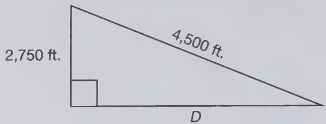

text_image

2,750 ft.
4,500 ft.
D

Use the Pythagorean theorem to determine the value of $D$ : $2,750^2 + D^2 = 4,500^2$ , which simplifies to $D^2 = 12,687,500$ , so that $D = \sqrt{12,687,500} \approx 3,562$ feet. Choice a is wrong because when applying the Pythagorean theorem, you forgot to square the sides. Choice c is wrong because this is a right triangle, so the two longest sides cannot have the same length. Choice d is wrong because when applying the Pythagorean theorem, you treated the zip line as a leg when it is the hypotenuse. Choice e is wrong because when applying the Pythagorean theorem, you treated the zip line as a leg when it is actually the hypotenuse, and you forgot to square the sides.

28. e. Gather like variables in the product and add their exponents:

$$
\begin{array}{l} (3 g ^ {2} h) \cdot (2 j ^ {3} g h ^ {5}) = (3 \cdot 2) (g ^ {2} \cdot g) \cdot (h \cdot h ^ {5}) \cdot (j ^ {3}) \\ = 6 g ^ {3} h ^ {6} j ^ {3} \\ \end{array}
$$

Choice a is wrong because you applied the exponents of the adjacent variable to each coefficient, but this would require there to be another set of parentheses. Specifically, $(3g)^{2} = 3^{2}g^{2}$ , but this does not equal $3g^{2}$ .

Choice b is wrong because you multiplied the exponents instead of adding them.

Choice c is wrong because the power on h should be 2 in this form. Choice d is wrong because you ignored the coefficients.

29. d. The radius of the globe is 1.5 feet, which equals 18 inches (since 1 foot = 12 inches). The volume of a sphere with radius r is $\frac{4}{3}\pi r^{3}$ . Substituting r = 18 inches into this formula gives a volume of 7,776π cubic inches. Choice a is wrong because this is the surface area, not the volume; the volume formula is $\frac{4}{3}\pi r^{3}$ . Choice b is wrong because you need to multiply by 4; the volume formula is $\frac{4}{3}\pi r^{3}$ . Choice c is wrong because this would be the surface area, not the volume, of a sphere with radius 3 feet (or 36 inches). You used the wrong formula and used the diameter in place of the radius. Choice e is wrong because you used the diameter in place of the radius when computing the volume.

30. c. The most expedient approach is to use the elimination method because simply adding the equations will result in the y-terms canceling. Doing so yields 4x = 48, so that x = 12. Substituting this value into the first equation yields $2(12) - 3y = 21$ . This is equivalent to -3y = -3, so that y = 1. Thus, the solution is x = 12, y = 1. Choice a is incorrect because you subtracted the left sides of the equations, but added the right sides. Choice b is incorrect because this pair satisfies the first equation, but not the second one; hence, it is not a solution of the system. Choice d is incorrect because this pair satisfies the second equation, but not the first one; hence, it is not a solution of the system. Choice e is incorrect because adding the equations yields an equation for which there is a value of x; substituting this value into either equation then yields the corresponding value of y.

31. 58 degrees. Since the line passing through A and C is tangent at point A, the radial segment connecting the center, B, to A is perpendicular to it. So, the triangle ABC is a right triangle. Since the sum of the three interior angles of a triangle is 180 degrees, the measure of angle ABC must be 58 degrees.

32. d. To compute the expected value of such a random variable, multiply x times $P(X = x)$ and sum all of them. Doing so yields:

$$
\begin{array}{l} (- 6) \left(\frac {1}{1 8}\right) + (- 2) \left(\frac {2}{9}\right) + 0 \left(\frac {1}{6}\right) + 3 \left(\frac {7}{1 8}\right) + 5 \left(\frac {1}{6}\right) \\ = - \frac {1}{3} - \frac {4}{9} + \frac {7}{6} + \frac {5}{6} = \frac {2 2}{1 8} = \frac {1 1}{9}. \\ \end{array}
$$

Choice a is wrong because this is the minimum value of the data set, not the expected value. Choice b is wrong because you added the x-values, but did not multiply each one by $P(X = x)$ . Choice c is wrong because you summed the probabilities, which must add to 1, but you must multiply each one by its respective value of x. Choice e is wrong because even though this value of x has the highest probability associated with it, the expected value is not simply this value.

Rather, you must multiply each value of X by its probability of occurring and sum those values.

33. d. Let x represent the actual distance between the two rides. Using the information provided, we have the following proportion:

$$
\frac {1 \text {   inch }}{7 5 0 \text {   feet }} = \frac {3 . 8 \text {   inches }}{x \text {   feet }}
$$

(1 inch)(x feet) = (750 feet)(3.8 inches)

$$
x = \frac {(7 5 0 \text {   feet }) (3 . 8 \text {   inches })}{1 \text {   inch }}
$$

$$
= 2, 8 5 0 \text {   feet   }
$$

Solving for x yields x = 2,850 feet. Choice a is wrong because you set up the proportion incorrectly; you should be multiplying 750 by 3.8, not dividing by it. Choice b is wrong because you simply added 750 feet to 3.8 inches, which is incorrect. You must set up a proportion consisting of two ratios, one corresponding to what 1 inch represents and one corresponding to what 3.8 inches represents. Choice c is wrong because you seem to have misunderstood how to work with proportions. Set up the proportion $\frac{1\ inch}{750\ feet} = \frac{3.8\ inches}{x\ feet}$ and solve for x. Choice e is wrong because you can set up the following proportion, where x represents the actual length of the path:

$$
\frac {1 \text {   inch }}{7 5 0 \text {   feet }} = \frac {3 . 8 \text {   inches }}{x \text {   feet }}
$$

34. b. You must determine the equation of the parabola and the line and equate them.

The equation of the parabola has the form $y = a(x - h)^{2} + k$ . The vertex is (2,2), so this becomes $y = a(x - 2)^{2} + 2$ . To find a, use one of the labeled x-intercepts, say (1,0). Substitute this into the equation to obtain $0 = a(1 - 2)^{2} + 2$ . Solving for a yields a = -2. So, the equation of the parabola is $y = -2(x - 2)^{2} + 2$ . To find the equation of the line in slope-intercept form $y = mx + b$ , use the two labeled points to find the slope: $m = \frac{2 - 0}{0 - 4} = -\frac{1}{2}$ . Since the y-intercept is 2, the equation of the line is $y = -\frac{1}{2}x + 2$ . Equating these the equation $-2(x - 2)^{2} + 2 = -\frac{1}{2}x + 2$ . The solutions of this equation would yield the x-coordinates of the points of intersection of the two graphs shown. Canceling the constant 2 on each side yields the simplified equation $-2(x - 2)^{2} = -\frac{1}{2}x$ . Choice a is wrong because the coefficient on the left side should be -2 since the parabola opens downward. Otherwise, the equation is correct. Choice c is wrong because there are errors in the equation of the parabola and the line. The coefficient on the left side should be -2 and the slope of the line is $-\frac{1}{2}$ , not -2. Choice d is wrong because this is the result of getting the slope wrong for the line; it is $-\frac{1}{2}$ , not -2. Choice e is wrong because there are errors in the equation of the parabola and the line. The coefficient on the left side should be -2 and the y-intercept of the line is 2, not 4.

35. d. You must express profit as an expression involving the number of decks or fences power-washed. The \$1,175 spent on materials is negative profit, so it will appear as -1,175 in the expression. Next, since Nathan earns \$50 per deck or fence power-washed and it costs \$6.50 per job, his net gain per job is \$50 - \$6.50 = \$43.50. This is constant, so the profit gained from power-washing x fences or decks is 43.50x dollars. The expression describing his profit is thus 43.50x - 1,175. Now, to compute the break-even point, we need to determine the number of decks or fences power-washed that will yield a profit of 0 dollars. This requires that we solve the equation 0 = 43.50x - 1,175:

$$
0 = 4 3. 5 0 x - 1, 1 7 5
$$

$$
1. 1 7 5 = 4 3. 5 0 x
$$

$$
2 7. 0 1 \approx x
$$

You must round up and conclude that Nathan will break even after power-washing 28 decks or fences. Choice a is wrong because you mistakenly included the cost of gas, \$6.50 per job, as profit rather than as debt. For each deck or fence power-washed, he earns \$50 – \$6.50, not \$50 + \$6.50. Choice b is wrong because you did not account for the cost in gas for each job. Choice c is wrong because you must round up, not down, to ensure he has earned enough cash to break even. Choice e is wrong because this is the number of driveways Nathan must clear to earn \$1,175 in profit, not just break even.

36. a. There are 60 minutes in one hour and 60 seconds in one minute. So, there are $60 \times 60$ seconds in one hour. There are 5,280 feet in a mile. Using these enables us to convert from miles per hour to feet per second as follows:

$$
\begin{array}{l} \frac {7 0 \text {   miles }}{1 \text {   hour }} = \frac {7 0 \text {   miles }}{1 \text {   hour }} \times \frac {1 \text {   hour }}{6 0 \times 6 0 \text {   seconds }} \times \frac {5 , 2 8 0 \text {   feet }}{1 \text {   mile }} \\ = \frac {7 0 \times 5 , 2 8 0}{6 0 \times 6 0} \text {   feet   per   second } \\ \end{array}
$$

Choice b is wrong because there are $60 \times 60$ seconds in one hour, not just 60. Choice c is wrong because when setting up the conversion, you inverted both fractions. Choice d is wrong because you did not account for the fact that there are 5,280 feet in one mile. Also, there are $60 \times 60$ seconds in one hour. Choice e is wrong because you did not account for the fact that there are 5,280 feet in one mile.

37. -5. Use the fact that $y = f(x)$ if and only if $x = f^{-1}(y)$ . Using this with the table shows that $f^{-1}(-6) = 8$ and $f^{-1}(8) = -5$ . Thus, $f^{-1}(f^{-1}(-6)) = f^{-1}(8) = -5$ .   
38. 0.0366. The most efficient approach is to group the powers of 10 together and the two decimals together. Simplify each, and then convert the resulting expression to a decimal.

$$
(3 0. 5 \times 1 0 ^ {4}) \times (1. 2 \times 1 0 ^ {- 7}) = (3 0. 5 \times 1. 2)
$$

$$
\times (1 0 ^ {4} \times 1 0 ^ {- 7})
$$

$$
= 3 6. 6 \times 1 0 ^ {- 3}
$$

$$
= 0. 0 3 6 6
$$

39. d. Use the two labeled points on the line—(3,0) and (8,10)—to compute the slope:

$$
\begin{array}{l} m = \frac {1 0 - 0}{8 - 3} = \frac {1 0}{5} = 2. \text { Using   point - slope   form } \\ \text { with   the   point(3,0) yields y - (0) = 2(x - 3).} \end{array}
$$

This simplifies to y = 2x - 6, which is equivalent to 2x - y = 6. Choice a is wrong because when converting the equation from point-slope formula (namely $y = 2(x - 3)$ ) to standard form, you did not distribute the 2 to both terms in parentheses on the right side.

Choice b is wrong because you calculated the slope incorrectly; it should be the change in y-coordinates divided by the change in x-coordinates, not the reciprocal. Choice c is wrong because you computed the slope by subtracting the x-coordinates from the y-coordinates of each point, but the slope is computed as the change in y-coordinates divided by the change in x-coordinates.

Choice e is wrong because you mistakenly treated the point $(3,0)$ as the y-intercept and used b = 3 in the slope-intercept form $y = mx + b$ . But it is the x-intercept.

40. c. The height is 3(60 feet) = 180 feet and the radius is $\frac{1}{2}$ (60 feet) = 30 feet. So, the volume of the cylinder is

$$
\begin{array}{l} V = \pi r ^ {2} h = \pi (3 0 \text {   feet }) ^ {2} (1 8 0 \text {   feet }) \\ = 1 6 2, 0 0 0 \pi \text {   cubic   feet   } \\ \end{array}
$$

Choice a is wrong because you used the diameter in place of the radius, and forgot to square the radius when computing the volume. Choice b is wrong because you used the formula for the volume of a right circular cone $V = \frac{1}{3}\pi r^{2}h$ , but the volume of a cylinder does not include a multiple of $\frac{1}{3}$ . Choice d is wrong because you used the diameter in place of the radius when computing the volume.

Choice e is wrong because you misinterpreted the relationship between the radius and the height. Specifically, the given information means that the height is 3(60 feet), not that the radius is 3(60 feet).

41. (6,8). You need to translate the given point 7 units to the right and 2 units upward. Consequently, the point $(-1,6)$ translates to the point $(-1 + 7,6 + 2) = (6,8)$ .

42. a. The tent is made up of five faces. The front and the back of the tent are congruent equilateral triangles. Dropping an altitude from the top vertex to the opposite side gives the height of the triangle. This creates a 30-60-90 triangle, so the height is $4\sqrt{3}$ feet. Thus, the area of the front and back is $(4\sqrt{3}\mathrm{ft.})(8\mathrm{ft.}) = 16\sqrt{3}\mathrm{ft}.^2$ ; so their combined area is $32\sqrt{3}\mathrm{ft}.^2$ . The other three faces of the tent are congruent rectangles with width 8 feet and length 12 feet, so each has an area of $(8\mathrm{ft.})(12\mathrm{ft.}) = 96\mathrm{ft}.^2$ . Their combined area is $3(96) = 288\mathrm{ft}.^2$ . Therefore, the surface area is $(288 + 32\sqrt{3})\mathrm{ft}.^2$ . Choice b is the volume, not the surface area. Choice c did not include the bottom of the tent. Choice d did not include the two top side portions of the tent. Choice e included only one of the two triangular sides of the tent (that is, you forgot either the front or the back).

43. e. The largest whole number that goes into all of 18, 30, and 12 is 6. The largest power of p that goes into all of $18p^{2}q$ , $30pq^{2}$ , $12pq^{3}$ is p, and the largest power of q that goes into all of these terms is q. So, the greatest common factor is 6pq. Choice a is the least common multiple. Choice b is wrong because 12 is not a factor of 18 or 30, and the power of q is not correct. Choice c is a common factor of all three terms, but is not the greatest common factor. Choice d is the product of all three terms; this is a common multiple, but not a common factor.

44. c. First, arrange the members of each data set in increasing order. Then, compute each of their means and medians.

I. 0, 26, 26, 26, 26

II. -22,-22,-22,98,98

III. 26, 26, 26, 26

The median for I is 26, but the mean is $\frac{26(4)}{5} = 20.8$ . So, the mean is not 26.

The median for II is -22, which is not 26.

The median for III is $\frac{26+26}{2}=26$ . The mean is $\frac{26(4)}{4}=26$ .

45. a. Transform the division problem into a multiplication problem. Then, factor all numerators and denominators and cancel factors common to the numerator and denominator, as follows:

$$
\begin{array}{l} \frac {3 2 x - 8}{4 x ^ {2} - 1} \div \frac {1 6 x ^ {2} - 4 x}{2 x - 1} = \frac {3 2 x - 8}{4 x ^ {2} - 1} \cdot \frac {2 x - 1}{1 6 x ^ {2} - 4 x} \\ = \frac {2 8 (4 x - 1)}{(2 x - 1) (2 x + 1)} \cdot \frac {2 x - 1}{4 x (4 x - 1)} \\ = \frac {2}{x (2 x + 1)} \\ = \frac {2}{2 x ^ {2} + x} \\ \end{array}
$$

Choice b is incorrect because you did not distribute the x through both terms in the denominator when simplifying $\frac{2}{x(2x+1)}$ .

Choice c is incorrect because you incorrectly canceled the 2's in numerator and denominator of $\frac{2}{2x^{2}+x}$ ; these are terms, not factors, and cannot be canceled in this manner.

Choice d is incorrect because you did not distribute the x through both terms in the denominator when simplifying $\frac{2}{x(2x+1)}$ , and you incorrectly canceled the 2's in numerator and denominator of $\frac{2}{2x^{2}+x}$ ; these are terms, not factors, and cannot be canceled in this manner. Choice e is incorrect because you canceled the wrong factor in the denominator with 2x-1 in the numerator.

46. b and c. Choices a and d are not correct selections because the bulk of the data (more than 50%) are to the left of the y-axis, so the median is negative. Choices b and c are correct selections because more than 50% of the data are to the right of the y-axis, so the median is positive. Choice c is not a correct selection because the median is 0.

47. e. Statement I is false because it is the result of incorrectly canceling common terms, not factors, in the numerator and denominator. This is never true when $a$ and $b$ are positive integers. In fact, the only way it can be true is if either $a$ or $b$ is zero. Statement II is false because if $b = 1$ , then $a \cdot b = a$ . Statement III is true because this is the way fractions are added. The common denominator is $ab$ . Multiplying the top and bottom of first fraction by $b$ and the top and bottom of the second fraction by $b$ and then adding the fractions yields this statement.

48. c. First, observe that to move $A$ to $A'$ , we must move the point left 10 units and then up 2 units. The translation rule $(x,y) \to (x - 10, y + 2)$ describes this action. Applying this to all points of the square ABCD moves it to a new location in the plane. Now, observe that this square is larger than LMNP so that the scale factor must be less than 1. Observe that $A'B'$ is three times the length of AB; the same is true of the other three pairs of sides since it is a square. So, the scale factor should be $\frac{1}{3}$ . Choice a would be used to transform square LMNP into ABCD. Choice b used the wrong scale factor; this would create a square three times larger than ABCD. Choice d is wrong because you did not pay attention to the value of the hash marks when forming the translation rule. Choice e is wrong because while the scale factor is correct, the translation rule moves ABCD to the right and down rather than left and up.

49. a, d, and e. Choice a is a correct selection because this is the very definition of probability. Choice b is not a correct selection because the model suggests a long-run likelihood of getting a 4. No definitive conclusion can be drawn from just ten rolls of the die, though if you were to continue to roll the die and repeatedly get a 4 and no other number, then the validity of the model could be called into question. Choice c is not a correct selection because the model suggests a long-run likelihood of getting a 4. No definitive conclusion can be drawn from 100 rolls of the die, though it does suggest that the model may be incorrect. Choice d is a correct selection because the model suggests a long-run likelihood of getting a 4. No definitive conclusion can be drawn from just 20 rolls of the die. Choice e is a correct selection because the model suggests a long-run likelihood of getting a 4. Such rolls are independent of each other and certainly can come out this way and not contradict the model.

50. $\frac{25}{6}w^{2} + -1,000w + -70,000 = 0$ . Since the five pens are identical and no fence is needed along the backside by the barn, there are five sides of length w and six sides of length l that need fencing. Since Jacob has 1,200 feet of fence to use to construct all five pens, the sum of the lengths of all sides of the five pens must be 1,200. This leads to the following equation relating w and l: $5w + 6l = 1,200$ . Next, the combined area of the five pens is $(5w) \cdot l$ . To get an expression in terms of only w, solve the perimeter equation for l and substitute it in:

$$
5 w + 6 l = 1, 2 0 0 \Rightarrow l = \frac {1 , 2 0 0 - 5 w}{6}
$$

The combined area of the pens is

$$
(5 w) \cdot l = (5 w) \cdot \frac {1 , 2 0 0 - 5 w}{6} = 1, 0 0 0 w - \frac {2 5}{6} w ^ {2}
$$

We are given that the combined area is to be 70,000 square feet. To find the width of each pen, we equate the expression for the area to 70,000: $1,000w - \frac{25}{6}w^{2} = 70,000$ . Take all terms to the right side to get the equivalent equation $\frac{25}{6}w^{2} - 1,000w - 70,000 = 0$ .

51. c, d, and e. Choice a is not a correct selection because the square root of any perfect square is rational; for instance, $\sqrt{9} = 3$ . Choice b is not a correct selection because the set of rational numbers is closed under division, so the quotient must be rational. Choice c is a correct selection because $\sqrt{2} \cdot \sqrt{2} = 2$ , for instance. Choice d is a correct selection by the very nature of how rational and irrational numbers behave. Choice e is a correct selection because $\frac{\sqrt{2}}{\sqrt{3}} = \frac{1}{3}\sqrt{6}$ , which is irrational.

52. $\frac{20}{9}\pi$ meters. Since the radius of the circle is 5 meters, the circumference of the entire circle is $2\pi r = 10\pi$ meters. The central angle opposite the arc whose length we seek, labeled x, is $80^{\circ}$ . So, the portion of the circle to which this arc corresponds is $\frac{80}{360} = \frac{2}{9}$ . So, the length, x, of this arc is $\frac{2}{9} \cdot 10\pi$ meters = $\frac{20}{9}\pi$ meters.

53. e. First, write each fraction with the least common denominator $(x + 1)^{2}$ . Then, subtract the numerators by simplifying each expression and then combining like terms, as follows:

$$
\begin{array}{l} \frac {2}{(x + 1) ^ {2}} - \frac {x}{x + 1} = \frac {2}{(x + 1) ^ {2}} - \frac {x (x + 1)}{(x + 1) ^ {2}} \\ = \frac {2 - x (x + 1)}{(x + 1) ^ {2}} \\ = \frac {2 - x ^ {2} - x}{(x + 1) ^ {2}} \\ = \frac {- (x ^ {2} + x - 2)}{(x + 1) ^ {2}} \\ = \frac {- (x - 1) (x + 2)}{(x + 1) ^ {2}} \\ \end{array}
$$

Choice a is wrong because you did not distribute x to both terms when simplifying the product $x(x + 1)$ . Choice b is wrong because you subtracted the numerators without first converting the second fraction to an equivalent one whose denominator is $(x + 1)^{2}$ .

Choice c is wrong likely because of factoring $x^{2} + x - 2$ incorrectly. Choice d is wrong because you did not distribute x to both terms when simplifying the product $x(x + 1)$ and you used $(x + 1)^{3}$ as the least common denominator instead of $(x + 1)^{2}$ , but in so doing did not multiply the numerator and denominator of the first fraction by $x + 1$ to convert it to an equivalent fraction with this denominator.

54. a, c, and d. Choice a is a correct selection because each number in this set has 2, 3, and 6 as factors and so cannot be prime. Choice b is not a correct selection because 6, for instance, is not divisible by 4. Choice c is a correct selection because every number in this set is divisible by 2 and hence is even, not odd. Choice d is a correct selection because every number in this set is of the form 6n for some whole number n, which means each number is a multiple of 6.

Choice e is not a correct selection because you are confusing the term factor with multiple. For the members of this set to be factors of 6, they must all divide into 6 evenly. The only one for which this is true is 6 itself, because all the other members are larger than 6.

55. 12 gallons. Two of the walls have dimensions 18 feet by 10 feet; the combined area of these two walls is $2 \cdot (18 \cdot 10) \text{ feet}^2 = 360 \text{ feet}^2$ . The other two walls have dimensions 22 feet by 10 feet; the combined area of these two walls is $2 \cdot (22 \cdot 10) \text{ feet}^2 = 440 \text{ feet}^2$ . The ceiling has dimensions 18 feet by 22 feet, so its area is $396 \text{ feet}^2$ . The total square footage that must be painted is $360 + 440 + 396 = 1,196$ square feet. This must be multiplied by 3 to apply three coats, giving the total square footage to be 3,588 square feet. Finally, divide this by 300 to obtain 11.96 gallons of paint, which we round to 12.

56. b and e. Choice a is not a correct selection because the left side equals 7, but the right side equals 5. Choice b is a correct selection because using the properties of radicals yields $\sqrt{\frac{1}{5}} = \frac{\sqrt{1}}{\sqrt{5}} = \frac{\sqrt{1} \cdot \sqrt{5}}{\sqrt{5} \cdot \sqrt{5}} = \frac{\sqrt{5}}{5}$ . Choices c and d are both not correct selections because $e$ and $\pi$ are irrational and so cannot be equal to finite decimals; these are only approximations. Choice e is a correct selection because $\frac{1}{5} > \frac{1}{7}$ and taking the square root of both sides retains the inequality.